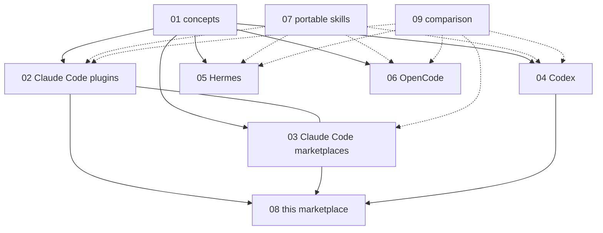

# 00. Index

This is a ten-file reference on plugins, marketplaces and skills across four agent hosts: Claude Code, Codex CLI, Hermes Agent and OpenCode. A skill is a folder with a `SKILL.md` file that an agent loads only when it needs it. A plugin is a host-specific bundle that ships skills and other parts. A marketplace is a catalog file that lists plugins and where to fetch each one. The one thing to know: **only the skill is portable. Plugins and marketplaces are host-specific.**

## Files

Each row gives one file and the question that sends you to it.

| File | Read this when |
| --- | --- |
| [01_concepts.md](01_concepts.md) | You need the shared vocabulary: skill, plugin, marketplace, registry, agent, command, hook, MCP server. |
| [02_claude-code-plugins.md](02_claude-code-plugins.md) | You build, install or debug a Claude Code plugin, or you need the `plugin.json` field list. |
| [03_claude-code-marketplaces.md](03_claude-code-marketplaces.md) | You publish or consume a Claude Code marketplace, or you need source types and version pinning. |
| [04_codex.md](04_codex.md) | You ship a plugin to Codex CLI, or you hit the gap between the Codex runtime loader and the publishing validator. |
| [05_hermes.md](05_hermes.md) | You write a Hermes skill, use the Skills Hub, or migrate skills from Claude Code. |
| [06_opencode.md](06_opencode.md) | You extend OpenCode, which has code-module plugins and no marketplace. |
| [07_skills-portable.md](07_skills-portable.md) | You want one skill folder that runs unchanged on all four hosts. |
| [08_this-marketplace.md](08_this-marketplace.md) | You work in this repository: layout, the two host layers, adding a plugin, releasing a version. |
| [09_comparison.md](09_comparison.md) | You need the host-by-host table: manifests, install commands, scopes, trust. |

## Reading order

Pick the path that matches your job. Each path is short and ordered.

### Path A: new to the topic

1. Read [01_concepts.md](01_concepts.md) for the words.
2. Read [09_comparison.md](09_comparison.md) for the host-by-host view.
3. Read the one platform file you actually use: 02, 04, 05 or 06.

### Path B: authoring a skill or a plugin

1. Read [07_skills-portable.md](07_skills-portable.md) and write the skill to the standard.
2. Read your target host file: [02_claude-code-plugins.md](02_claude-code-plugins.md), [04_codex.md](04_codex.md), [05_hermes.md](05_hermes.md) or [06_opencode.md](06_opencode.md).
3. Read [03_claude-code-marketplaces.md](03_claude-code-marketplaces.md) if you publish through a Claude Code catalog.
4. Check [09_comparison.md](09_comparison.md) section 12 before you rely on any non-standard field.

### Path C: operating this marketplace

1. Read [08_this-marketplace.md](08_this-marketplace.md) first. It owns the repository rules.
2. Read [03_claude-code-marketplaces.md](03_claude-code-marketplaces.md) for the manifest schema you edit.
3. Read [04_codex.md](04_codex.md) for the constraints that limit what the generated Codex layer can hold.

## How the files relate

Concepts sit at the top. The four platform files sit in a row below them. The portable skill file and the comparison file cut across all four. This repository sits at the bottom.

## Conventions

These rules hold in every file of the set.

1. Sentences are short. One idea per sentence. Active voice.
2. Every technical term gets one definition the first time it appears.
3. A claim we could not confirm from an official source or from code in this repository is marked **not verified**. Treat those lines as open questions.
4. Each file leads with its answer, then gives the detail.
5. Each file ends with a `## Sources` section listing the URLs it relied on.
6. Facts were checked on 2026-09-03 against Claude Code 2.1.259 and `codex-cli` 0.149.1. Hermes and OpenCode facts come from their official docs, not from a local install.
7. This ten-file set replaces the older 90-file reference under `Documentation/ClaudePlugin/` and `Documentation/ClaudeSettings/`.

## Sources

- https://agentskills.io/specification
- https://code.claude.com/docs/en/plugins
- https://code.claude.com/docs/en/plugin-marketplaces
- https://developers.openai.com/codex/plugins/build
- https://hermes-agent.nousresearch.com/docs/user-guide/features/skills
- https://opencode.ai/docs/plugins
