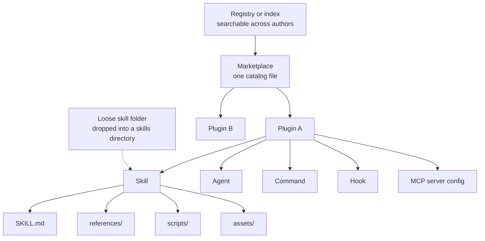
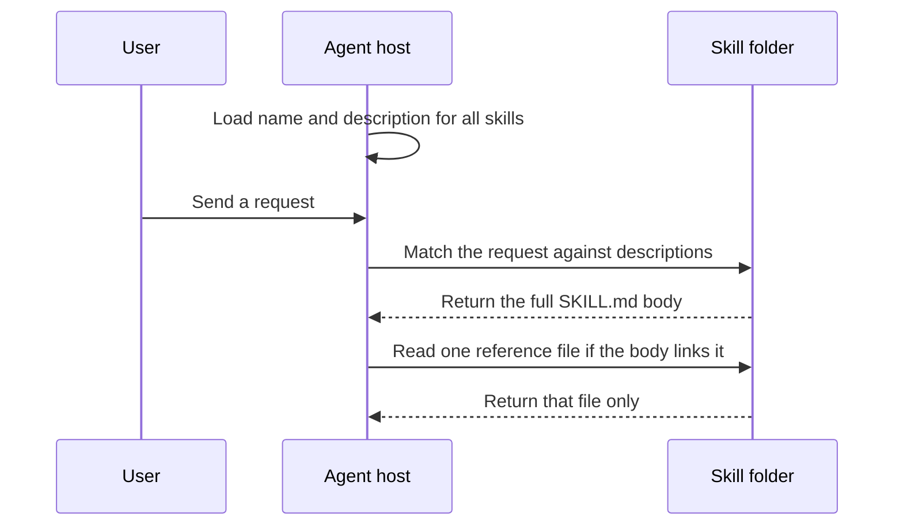

# 01. Concepts

This file defines the words used across the whole doc set. It is platform neutral. The one thing to know: **a skill is a folder of instructions that an agent loads only when it needs them.** Every other concept here is either a container for skills or a different kind of extension that sits beside them.

Read this file first. Then read the platform files for the details: [02_claude-code-plugins.md](02_claude-code-plugins.md), [03_claude-code-marketplaces.md](03_claude-code-marketplaces.md), [04_codex.md](04_codex.md), [05_hermes.md](05_hermes.md), [06_opencode.md](06_opencode.md).

## 1. The core model

An agent host keeps a small index of what it can do. It loads the full text only when a task needs it.

A skill is the unit the model works on. A skill is a directory. The directory holds one `SKILL.md` file with YAML frontmatter and Markdown instructions. YAML frontmatter is a small metadata block at the top of the file between two `---` lines. The host reads the frontmatter at startup. The host reads the body only after it picks the skill.

This gives three properties that shape everything else:

1. A skill adds no new code path to the host. It is text plus files.
2. A skill is portable. Any host that reads `SKILL.md` can run it.
3. A skill costs almost no context until it is used.

Every other concept in this file falls into one of three groups. It packages skills, it ships them, or it is a different extension point that does add a code path.

## 2. Definitions

Eight terms cover the whole field. The table gives the short answer. The notes below give the detail that the table cannot hold.

| Term | Definition | Adds executable code to the host |
| --- | --- | --- |
| Skill | A folder with a `SKILL.md` file. It holds instructions the agent loads on demand. | No |
| Plugin | A host-specific bundle that adds capability to one agent product. It can contain skills and other components. | Yes, depending on what it bundles |
| Marketplace | A catalog file that lists installable plugins and where to fetch each one. | No |
| Registry | A service or index that hosts many catalogs or many packages, so a host can search across authors. | No |
| Agent | A named assistant configuration with its own prompt, tool set and model. | No |
| Command | A named prompt the user invokes with a prefix such as `/name`. | No |
| Hook | A shell command or function the host runs automatically on a lifecycle event. | Yes |
| MCP server | A separate process that exposes external tools and data to the agent over the Model Context Protocol. | Yes |

### Skill

A skill is prose and files. The frontmatter needs two fields on every platform: `name` and `description`. The description is what the model matches against the user request, so it must say what the skill does and when to use it.

The open standard for the file format is Agent Skills at `agentskills.io`. Anthropic wrote it and released it as an open standard. The standard defines six frontmatter fields. Only `name` and `description` are required.

| Field | Required | Constraint |
| --- | --- | --- |
| `name` | Yes | 1 to 64 characters. Lowercase letters, digits and hyphens. No leading or trailing hyphen. No `--`. Must match the parent directory name. |
| `description` | Yes | 1 to 1024 characters. Non-empty. |
| `license` | No | A license name, or the name of a bundled license file. |
| `compatibility` | No | Up to 500 characters. States environment requirements. |
| `metadata` | No | A map of string keys to string values. The sanctioned place for host-specific extras. |
| `allowed-tools` | No | Space separated list of pre-approved tools. Marked experimental. Support varies by host. |

Hosts add their own frontmatter fields on top of this set. [07_skills-portable.md](07_skills-portable.md) owns that comparison.

### Plugin

A plugin is per-host packaging. The word means a different shape on each platform. Two hosts define a plugin as a directory with a JSON manifest. One host defines it as a Python module. One host defines it as a JavaScript module with no manifest at all.

A plugin is the level at which a host installs, versions, enables and disables things. A skill is the level at which the model reads instructions. Do not confuse the two.

### Marketplace

A marketplace is one JSON file. The file names the catalog, names its owner, and lists plugin entries. Each entry gives a plugin name and a source. The source says where to fetch the plugin: a local path, a git repository, a package, or an archive.

Adding a marketplace registers the catalog. It installs nothing. Installing a plugin is a second, separate step.

### Registry

A registry is the layer above a marketplace. It hosts many catalogs or many packages so a user can search across authors. No platform in this doc set uses the word "registry" as a formal manifest term. The nearest equivalents differ per host and appear in the naming table below.

### Agent

An agent is a named configuration, not a program. It sets a system prompt, a model, a tool allowlist and sometimes a permission set. A subagent is an agent the main conversation calls to do one bounded job and report back.

### Command

A command is a stored prompt with a name. The user types `/name` to run it. Some hosts have merged commands into skills, so one file creates both. Others keep them as separate file types.

### Hook

A hook binds a shell command or a function to a lifecycle event, such as "before a tool runs" or "after a file is edited". The host runs it without asking the model. This is the highest-risk component in any plugin, because it executes automatically at your own privilege level.

### MCP server

The Model Context Protocol is an open protocol for connecting an agent to external tools and data. An MCP server is a separate process that speaks it. A plugin can declare MCP servers, which means installing that plugin can start a new process on your machine.

## 3. How the parts nest

The containment chain runs registry, marketplace, plugin, component, file. A skill sits at the component level, and it also works alone with no plugin around it.



The dotted line matters. A skill needs no plugin and no marketplace. Copy the folder into a skills directory and it works.

A skill folder on disk looks like this:

```text
my-skill/
├── SKILL.md          # required: frontmatter plus instructions
├── references/       # optional: documents loaded on demand
├── scripts/          # optional: executable helpers
└── assets/           # optional: templates, images, data
```

## 4. Progressive disclosure

Progressive disclosure means the host loads the smallest useful piece first and pulls in more only when the task calls for it. It is the reason a machine can hold hundreds of skills without filling its context window.

The Agent Skills standard defines three tiers.

| Tier | What loads | When | Size guidance |
| --- | --- | --- | --- |
| 1. Metadata | `name` and `description` | At startup, for every installed skill | About 100 tokens per skill |
| 2. Instructions | The full `SKILL.md` body | When the skill is activated | Under 5000 tokens recommended. Keep `SKILL.md` under 500 lines |
| 3. Resources | Files under `references/`, `scripts/`, `assets/` | Only when the instructions point at them | No stated limit |



The authoring rules that follow from these tiers live in [07_skills-portable.md](07_skills-portable.md).

## 5. What each platform calls each concept

The concepts match across hosts. The names and the file formats do not. This table gives the naming only. Each platform file owns its own detail.

| Concept | Claude Code | Codex | Hermes | OpenCode |
| --- | --- | --- | --- | --- |
| Skill | Skill, `skills/<name>/SKILL.md` | Skill, `.agents/skills/<name>/SKILL.md` | Skill, `~/.hermes/skills/<category>/<name>/` | Skill, six discovery paths including `.claude/skills` and `.agents/skills` |
| Plugin | Plugin, `.claude-plugin/plugin.json` | Plugin, `.codex-plugin/plugin.json` | Plugin, Python module with `plugin.yaml` | Plugin, JavaScript or TypeScript module. No manifest file |
| Marketplace | `.claude-plugin/marketplace.json` | `.agents/plugins/marketplace.json` | Skills Hub for skills. Community plugin index for plugins | None |
| Registry | `claude-plugins-official` and `claude-community` | Universal public plugin directory | Taps, which are GitHub repos of skills | npm, plus a hand-curated ecosystem page |
| Agent | Subagent, `agents/*.md` | None as a packaged plugin component, not verified | Delegation toolset and subagent hooks. Packaged agent component not verified | Agent, primary or subagent, `agents/*.md` |
| Command | Merged into skills. A skill is a command | `commands/` loads at runtime. Publishing validation rejects it | Slash command derived from a skill, a bundle, or a plugin | Command, `commands/*.md` |
| Hook | `hooks/hooks.json` | `hooks/hooks.json` loads at runtime. Publishing validation rejects it | Plugin hooks, gateway hooks, shell hooks | Plugin hook functions, no separate file |
| MCP server | `.mcp.json` in the plugin | `.mcp.json` in the plugin | `mcp_servers` in `config.yaml`. Not shipped inside a skill | `mcp` key in `opencode.json`. Not shipped inside a plugin |

Read the table with two cautions.

- "None" means the host has no such thing. It does not mean the job is impossible. OpenCode has no marketplace manifest, but npm plus the `opencode plugin` command does the install job.
- A shared word can hide a different shape. A Claude Code plugin and an OpenCode plugin share a name and almost nothing else.

[09_comparison.md](09_comparison.md) holds the full side-by-side comparison, including install commands and update behaviour.

## 6. Content and code: the line that decides trust

Split every component into two classes. The split tells you what a bad actor could do.

| Class | Components | What it can do |
| --- | --- | --- |
| Content | Skills, agents, commands, marketplace entries | Change what the model is told. It can still ask the model to run a shell command, so it is not harmless |
| Code | Hooks, MCP servers, LSP servers, background monitors, executables placed on `PATH` | Run on your machine at your own privilege, often without a prompt |

Claude Code states the risk directly. A plugin can run any code on your machine at your own privilege level. [02_claude-code-plugins.md](02_claude-code-plugins.md) quotes the full warning.

This split explains a design rule used in this repository. A plugin meant to ship to more than one host should carry skills and nothing else. Skills are portable and are content. Hooks and MCP servers are per host and are code. See [08_this-marketplace.md](08_this-marketplace.md) for how that rule is applied here.

## 7. Where to read next

Pick the file that answers your question.

| Question | File |
| --- | --- |
| How do I build and install a Claude Code plugin? | [02_claude-code-plugins.md](02_claude-code-plugins.md) |
| How do I publish a Claude Code marketplace? | [03_claude-code-marketplaces.md](03_claude-code-marketplaces.md) |
| How does Codex differ? | [04_codex.md](04_codex.md) |
| How does Hermes differ? | [05_hermes.md](05_hermes.md) |
| How does OpenCode differ? | [06_opencode.md](06_opencode.md) |
| How do I write one skill that runs on all four? | [07_skills-portable.md](07_skills-portable.md) |
| How is this repository laid out? | [08_this-marketplace.md](08_this-marketplace.md) |
| Which host does what, side by side? | [09_comparison.md](09_comparison.md) |

## Sources

- https://agentskills.io/specification
- https://agentskills.io/client-implementation/adding-skills-support.md
- https://code.claude.com/docs/en/skills
- https://code.claude.com/docs/en/plugins
- https://code.claude.com/docs/en/plugin-marketplaces
- https://code.claude.com/docs/en/discover-plugins
- https://developers.openai.com/codex/plugins/build
- https://learn.chatgpt.com/docs/plugins
- https://learn.chatgpt.com/docs/build-skills
- https://hermes-agent.nousresearch.com/docs/user-guide/features/skills
- https://hermes-agent.nousresearch.com/docs/user-guide/features/plugins
- https://opencode.ai/docs/skills
- https://opencode.ai/docs/plugins
- https://opencode.ai/docs/mcp-servers
- https://opencode.ai/docs/ecosystem
