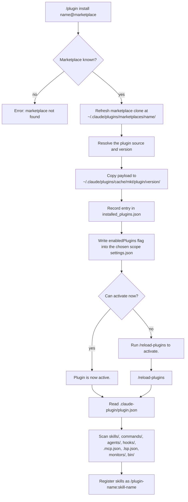

# 02. Claude Code plugins

This file defines the Claude Code plugin: its directory layout, its manifest fields, where it is stored on disk, the settings keys that switch it on, and the commands that install, update and remove it. The one thing to know: **a plugin is a directory of components.** The `.claude-plugin/plugin.json` manifest is optional while the components sit in their default folders. Only `name` is required inside that manifest.

This file does not cover `marketplace.json`. That is [03_claude-code-marketplaces.md](03_claude-code-marketplaces.md). For the cross-host view of skills, see [07_skills-portable.md](07_skills-portable.md). For general vocabulary, see [01_concepts.md](01_concepts.md).

All facts verified on 2026-09-03 against the official docs and a local Claude Code 2.1.259 install.

## 1. What a plugin is

The official docs describe a plugin as a "self-contained directory with skills, agents, hooks, or a `.claude-plugin/plugin.json` manifest". Claude Code loads its components when you enable the plugin. Two properties follow.

1. **Skills in a plugin are namespaced.** A skill folder `review/` in a plugin named `my-plugin` becomes the command `/my-plugin:review`. A personal skill in `~/.claude/skills/review/` becomes `/review`. Two plugins can therefore ship a skill with the same folder name.
2. **A plugin is the unit of distribution.** You install, enable, disable, update and uninstall a whole plugin. You cannot install one skill out of a plugin.

Claude Code merges custom commands into skills. A file at `.claude/commands/deploy.md` and a skill at `.claude/skills/deploy/SKILL.md` both create `/deploy`.

## 2. Directory layout

A plugin has one root directory. Every component folder sits at that root. Only `plugin.json` goes inside `.claude-plugin/`.

```text
my-plugin/                     <- the plugin root
├── .claude-plugin/
│   └── plugin.json            the manifest, optional
├── skills/
│   └── code-review/
│       ├── SKILL.md           required inside a skill folder
│       ├── reference.md       loaded only when SKILL.md links it
│       └── scripts/
├── commands/
│   └── deploy.md              a skill as one flat Markdown file
├── agents/
│   └── reviewer.md            subagent definitions
├── hooks/
│   └── hooks.json             event handlers
├── monitors/
│   └── monitors.json          background processes
├── workflows/                 workflow scripts
├── themes/                    colour themes, declared via experimental.themes
├── bin/                       executables put on the Bash tool PATH
├── .mcp.json                  MCP server configuration
├── .lsp.json                  LSP server configuration
├── settings.json              default settings, only `agent` and `subagentStatusLine`
└── README.md
```

The official docs state the common mistake plainly: "Don't put `commands/`, `agents/`, `skills/`, or `hooks/` inside the `.claude-plugin/` directory."

A plugin that ships exactly one skill may put `SKILL.md` at the plugin root instead of creating `skills/`. The frontmatter `name` then supplies the last command segment.

Two notes on this layout:

- The default folder name `output-styles/` for output styles is **not verified**. The reference confirms the `outputStyles` manifest key replaces a default, but does not name that default folder.
- A plugin distributed through claude.ai organization settings cannot include a top-level `bin/` directory.

## 3. The manifest: `plugin.json`

The manifest declares identity and points at components. Only `name` is required.

```json
{
  "name": "project-setup",
  "version": "0.4.1",
  "description": "How a repo is shaped.",
  "author": { "name": "Sid", "email": "developer@neuralabs.org" },
  "license": "PolyForm-Noncommercial-1.0.0",
  "dependencies": ["uvenv"],
  "skills": ["./skills/project-setup/"]
}
```

That example comes from the real manifest at `plugins/project-setup/.claude-plugin/plugin.json` in this repository. The `description` is shortened here.

### 3.1 Metadata fields

These fields describe the plugin. Only `name` changes how Claude Code addresses it.

| Field | Type | Meaning |
| --- | --- | --- |
| `name` | string | **Required.** Kebab-case identifier. Also the skill namespace prefix. |
| `$schema` | string | JSON Schema URL for editor autocomplete. |
| `displayName` | string | Human-readable name. Falls back to `name`. |
| `version` | string | Semantic version. Users get updates only when you bump it. |
| `description` | string | Shown in the plugin manager. |
| `author` | object | `name` is required inside it. `email` and `url` are optional. |
| `homepage` | string | Documentation URL. |
| `repository` | string | Source code URL. |
| `license` | string | License identifier. |
| `keywords` | array | Discovery tags. |
| `metadata` | object | Free-form. Claude Code never reads it. |
| `defaultEnabled` | boolean | Defaults to `true`. |

### 3.2 Component path fields

These fields point at component folders. Read section 3.3 before you set one.

| Field | Type | Meaning |
| --- | --- | --- |
| `skills` | string or array | Extra skill directories. |
| `commands` | string or array | Flat `.md` skill files. |
| `agents` | string or array | Agent definition files. |
| `workflows` | string or array | Workflow script files. |
| `outputStyles` | string or array | Output style files. |
| `hooks` | string, array or object | Hook config paths, or inline config. |
| `mcpServers` | string, array or object | MCP config paths, or inline config. |
| `lspServers` | string, array or object | LSP server configs. |
| `experimental.themes` | string or array | Colour theme files. |
| `experimental.monitors` | string or array | Background monitor configs. |
| `userConfig` | object | Values the user is prompted for at enable time. |
| `channels` | array | Message channel declarations. |
| `dependencies` | array | Other required plugins, with optional semver constraints. |

### 3.3 Path behaviour

Read this table before you set any component path. The three behaviours differ.

| Field | Behaviour |
| --- | --- |
| `skills` | **Adds to the default.** `skills/` is still scanned alongside your custom paths. |
| `commands`, `agents`, `workflows`, `outputStyles`, `experimental.themes`, `experimental.monitors` | **Replaces the default.** The default folder is no longer scanned. |
| `hooks`, `mcpServers`, `lspServers` | **Merge.** Multiple sources combine. |

To keep a default folder and add another, list both:

```json
{ "commands": ["./commands/", "./extras/"] }
```

Every path must be relative to the plugin root and start with `./`. The `skills` field also accepts `"."`. Both `"."` and `"./"` mean the plugin root.

### 3.4 Path variables

Three variables resolve to absolute paths inside plugin content and commands.

| Variable | Resolves to |
| --- | --- |
| `${CLAUDE_PLUGIN_ROOT}` | Absolute path to the plugin's install directory. Replaced on every update. |
| `${CLAUDE_PLUGIN_DATA}` | `~/.claude/plugins/data/{id}/`. Survives plugin updates. |
| `${CLAUDE_PROJECT_DIR}` | The project root. |

Claude Code substitutes these variables in four places. It substitutes them in skill and agent content, and in hook and monitor commands. For an MCP `stdio` server it substitutes them in `command`, `args` and `env`. For an MCP `http`, `sse` or `ws` server it substitutes them in `url`, `headers` and `headersHelper`. For an LSP server it substitutes them in `command`, `args`, `env` and `workspaceFolder`.

### 3.5 Dependencies

A dependency is another plugin that this plugin needs. Claude Code installs and enables dependencies for you when you install the plugin.

Each entry in `dependencies` is a bare name or an object.

```json
{
  "name": "deploy-kit",
  "version": "3.1.0",
  "dependencies": [
    "audit-logger",
    { "name": "secrets-vault", "version": "~2.1.0" },
    { "name": "audit-logger", "marketplace": "acme-shared" }
  ]
}
```

| Field | Required | Meaning |
| --- | --- | --- |
| `name` | Yes | Plugin name. Resolves in the same marketplace as the declaring plugin. |
| `version` | No | A semver range such as `~2.1.0`, `^2.0`, `>=1.4` or `=2.1.0`. Claude Code fetches the highest git tag that satisfies it. |
| `marketplace` | No | A different marketplace to resolve `name` in. |

Six rules govern resolution.

1. A bare name tracks whatever version its marketplace provides.
2. A `version` range resolves against git tags named `{plugin-name}--v{version}` on the repository that hosts the dependency. Create them with `claude plugin tag --push`. Tag rules are in [03_claude-code-marketplaces.md](03_claude-code-marketplaces.md).
3. A dependency in another marketplace is blocked unless the root marketplace lists that marketplace in `allowCrossMarketplaceDependenciesOn`. Otherwise the install fails with a `cross-marketplace` error.
4. When several plugins constrain the same dependency, Claude Code intersects the ranges. No common version gives a `range-conflict` error.
5. Disabling a plugin that another enabled plugin still needs is refused. The error prints the chained command to disable both.
6. A manifest with only `name` and `dependencies` is valid. It works as a bundle: one install pulls in the whole set.

For local testing, load the plugin and its dependency together with two `--plugin-dir` flags. Orphaned auto-installed dependencies are removed with `claude plugin prune`. Codex has no dependency field at all. See [04_codex.md](04_codex.md).

## 4. What a skill needs

A skill is a folder with a `SKILL.md` file. `SKILL.md` holds YAML frontmatter and Markdown instructions.

The official docs state: "All fields are optional. Only `description` is recommended so Claude knows when to use the skill." Claude Code reads the frontmatter only when the opening `---` is the first line of the file.

| Field | Required | Meaning |
| --- | --- | --- |
| `name` | No | The invocation name. In a plugin skill it sets the last command segment. Without it Claude Code falls back to the install directory name, which for a marketplace plugin is a version string that changes on every update. Always set it. |
| `description` | Recommended | What the skill does and when to use it. |
| `when_to_use` | No | Extra trigger phrases. Appended to `description` in the listing. |
| `argument-hint` | No | Autocomplete hint, for example `[issue-number]`. |
| `arguments` | No | Named positional arguments for `$name` substitution. |
| `disable-model-invocation` | No | `true` stops Claude loading the skill on its own. |
| `user-invocable` | No | `false` hides the skill from the `/` menu. |
| `allowed-tools` | No | Tools pre-approved for the turn that invokes the skill. |
| `disallowed-tools` | No | Tools removed while the skill is active. |
| `model` | No | Model to use while the skill is active. |
| `effort` | No | Effort level: `low`, `medium`, `high`, `xhigh`, `max`. |
| `context` | No | `fork` runs the skill in a forked subagent. |
| `agent` | No | Which subagent type to use when `context: fork` is set. |
| `background` | No | With `context: fork`, `false` waits for the result. |
| `hooks` | No | Hooks registered when the skill is invoked. |
| `paths` | No | Glob patterns that limit when the skill activates. |
| `shell` | No | `bash` default, or `powershell`. |
| `metadata` | No | Free-form map for your own tooling. |
| `license` | No | Agent Skills spec field. Accepted, not acted on. |
| `compatibility` | No | Agent Skills spec field. Up to 500 characters. |

Three limits shape how you write the frontmatter.

1. Claude Code truncates the combined `description` plus `when_to_use` text at **1,536 characters** in the skill listing. Put the key use case first.
2. Boolean fields accept `yes`, `no`, `on`, `off`, `1` and `0` in any case, as well as `true` and `false`.
3. Outside Claude Code only six fields are legal: `name`, `description`, `license`, `compatibility`, `metadata`, `allowed-tools`. Any other field is a hard error on claude.ai uploads, the Skills API and `package_skill.py`. The error reads `Unexpected key(s) in SKILL.md frontmatter: argument-hint.`

Keep `SKILL.md` short. Link `reference.md`, `examples.md` and `scripts/` from the same folder. Claude loads those files only when it follows the link. This is progressive disclosure.

## 5. Where installed plugins live

Claude Code copies an installed plugin into a cache directory. It does not run the plugin from the marketplace checkout.

```text
~/.claude/plugins/
├── cache/<marketplace>/<plugin>/<version>/    the plugin payload Claude Code loads
├── marketplaces/<marketplace-name>/           the cloned marketplace repo
├── data/<plugin-id>/                          ${CLAUDE_PLUGIN_DATA}
├── repos/                                     purpose not verified, empty here
├── known_marketplaces.json                    object keyed by marketplace name
├── installed_plugins.json                     {"version": 2, "plugins": {...}}
├── config.json
├── blocklist.json
└── plugin-catalog-cache.json
```

That tree was read from this machine on 2026-09-03. `installed_plugins.json` keys each plugin as `<plugin>@<marketplace>` and holds one array entry per scope. Each entry records `scope`, `installPath`, `version`, `installedAt` and `lastUpdated`, plus `projectPath` for a project-scope install. The payload lives once at user level even when the scope is `project`.

`<plugin-id>` in `data/` is `<plugin>@<marketplace>` with every character outside `a-zA-Z0-9_-` replaced by `-`. So `typescript-lsp@claude-plugins-official` becomes `typescript-lsp-claude-plugins-official`. Claude Code deletes the data directory when you uninstall the plugin from its last scope. Pass `--keep-data` to preserve it.

Whether Claude Code garbage-collects superseded versions from `cache/`, and on what schedule, is **not verified**.

## 6. Settings keys and scope

Two settings keys turn plugins on. Both live in a `settings.json` file.

| Key | Type | Scopes that accept it |
| --- | --- | --- |
| `enabledPlugins` | object, `"<plugin>@<marketplace>": boolean` | user, project, local, managed |
| `extraKnownMarketplaces` | object keyed by marketplace name | user, project, local, managed |
| `strictKnownMarketplaces` | array of source objects | managed only |
| `pluginConfigs` | object, `<plugin-id>.options` | user or managed only |
| `pluginSuggestionMarketplaces` | array | managed only |
| `disableBundledSkills` | boolean | user, project, local, managed |
| `strictPluginOnlyCustomization` | object of booleans for `agents`, `hooks`, `mcp`, `skills` | managed only |

```json
{ "enabledPlugins": { "project-setup@sids-plugin-marketplace": true } }
```

Whether `enabledPlugins` also accepts a version string instead of a boolean is **not verified**. The official docs describe booleans only.

[03_claude-code-marketplaces.md](03_claude-code-marketplaces.md) explains `extraKnownMarketplaces` and `strictKnownMarketplaces` in full.

`pluginConfigs` is narrower than the general ladder below. Claude Code reads it from managed settings, `--settings` and `~/.claude/settings.json` only. Claude Code ignores project and local files for that key.

### 6.1 Scope precedence

Settings precedence, highest first, quoted from the official settings page:

1. **Managed settings** in `managed-settings.json`, MDM, or the claude.ai console. Deployed by your organization.
2. **Command line**, `claude --settings`. You, this session.
3. **Project local**, `.claude/settings.local.json`. You, this project.
4. **Shared project**, `.claude/settings.json`. Everyone in the project.
5. **User**, `~/.claude/settings.json`. You, every project.

Managed settings file paths:

```text
macOS         /Library/Application Support/ClaudeCode/managed-settings.json
Linux and WSL /etc/claude-code/managed-settings.json
Windows       C:\Program Files\ClaudeCode\managed-settings.json
```

Claude Code does not read the legacy Windows path `C:\ProgramData\ClaudeCode\managed-settings.json`.

Skills outside plugins follow their own precedence: enterprise overrides personal, and personal overrides project. Plugin skills are namespaced, so they never clash.

One claim about `enabledPlugins` is **not verified**. It says the key forms a union across scopes. A plugin would then load once, no matter how many scopes enable it. No current official statement confirms this.

## 7. Install, enable, disable, update, uninstall

Two interfaces do the same work. Use the `/plugin` slash commands inside a session. Use the `claude plugin` shell commands for scripting. Adding the marketplace comes first; see [03_claude-code-marketplaces.md](03_claude-code-marketplaces.md).

```shell
# Inside a Claude Code session
/plugin                                       # open the manager
/plugin install project-setup@sids-plugin-marketplace
/plugin list --enabled
/plugin disable project-setup@sids-plugin-marketplace
/plugin enable project-setup@sids-plugin-marketplace
/plugin update project-setup@sids-plugin-marketplace
/plugin update                                # update every plugin
/plugin uninstall project-setup@sids-plugin-marketplace
/reload-plugins                               # apply changes without restarting
```

```bash
# From your shell, verified against claude 2.1.259
claude plugin install project-setup@sids-plugin-marketplace --scope user
claude plugin install my-plugin@my-mkt --config token=abc --yes
claude plugin list --json
claude plugin details project-setup
claude plugin enable project-setup
claude plugin disable --all
claude plugin update project-setup --scope user
claude plugin uninstall project-setup --scope project --keep-data --prune
claude plugin init my-tool
claude plugin validate ./my-plugin --strict
```

Scope values for `-s` or `--scope` are `user`, `project` and `local`. `claude plugin update` also accepts `managed`. The default is `user`.

Three behaviours to expect:

1. The install summary says either `Plugin is now active.` or `Run /reload-plugins to activate.` Run the command when it asks. If the reload would invalidate the prompt cache, rerun it as `/reload-plugins --force`.
2. `claude plugin install` never runs inside a session, so its plugins load on the next start or after `/reload-plugins`.
3. Auto-update runs after session start. The running session keeps the versions it loaded at launch. [03_claude-code-marketplaces.md](03_claude-code-marketplaces.md) owns the update rules and the environment variables that switch them off.

## 8. Test locally

Use `--plugin-dir` to load a plugin from disk with no install step.

```bash
claude --plugin-dir ./my-plugin
claude --plugin-dir ./my-plugin.zip
claude --plugin-dir ./plugin-one --plugin-dir ./plugin-two
claude --plugin-url https://example.com/my-plugin.zip
```

A `--plugin-dir` plugin with the same name as an installed one takes precedence for that session. The exception is a plugin that managed settings force-enable or force-disable. `--plugin-url` fetches a zip archive and loads it for that session only.

Run `/reload-plugins` after you edit a component. The claim that `--plugin-dir` plugins are identified as `<name>@inline` is **not verified**.

To skip the flag entirely, run `claude plugin init my-tool`. That scaffolds `~/.claude/skills/my-tool/` with a manifest and a starter `SKILL.md`. It loads next session as `my-tool@skills-dir`.

## 9. Install and load flow

This diagram shows what happens between the install command and the skill being callable.



## 10. Trust model in five lines

Five facts define the risk you take when you install a plugin.

1. Anthropic states it plainly: "Plugins and marketplaces are highly trusted components that can execute arbitrary code on your machine with your user privileges. Only install plugins and add marketplaces from sources you trust."
2. Hooks, monitors, MCP servers, LSP servers and `bin/` executables all run unsandboxed with your shell privileges, and some hooks fire automatically on session start.
3. Anthropic does not control or verify what a plugin contains, so read a plugin's source before you enable it.
4. An organization can lock the surface with managed-only keys: `strictKnownMarketplaces` allowlists marketplace sources, and `strictPluginOnlyCustomization` restricts skills, agents, hooks and MCP servers to plugin and managed sources.
5. A plugin may ship a root `settings.json`, but Claude Code honours only the `agent` and `subagentStatusLine` keys. A plugin cannot grant itself permissions or environment variables.

## Sources

- https://code.claude.com/docs/en/plugin-dependencies
- https://code.claude.com/docs/en/plugins
- https://code.claude.com/docs/en/plugins-reference
- https://code.claude.com/docs/en/skills
- https://code.claude.com/docs/en/discover-plugins
- https://code.claude.com/docs/en/settings
- https://code.claude.com/docs/en/settings-reference
- https://code.claude.com/docs/en/managed-settings
- Local verification: `claude --version` reporting 2.1.259, `claude plugin --help` and its subcommand help, and the on-disk tree at `~/.claude/plugins/`
