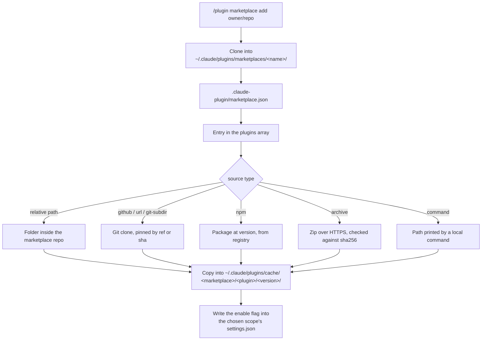

# 03. Claude Code marketplaces

A marketplace is a catalog of plugins. It is one JSON file, `.claude-plugin/marketplace.json`, at the root of a git repository or a folder. The one thing to know: **the marketplace file holds no plugin code.** It holds a list of entries. Each entry has a `source` that says where the code lives. A source can point inside the same repository or at a different one.

This file covers the marketplace layer only. For the plugin manifest and what a plugin can contain, see [02_claude-code-plugins.md](02_claude-code-plugins.md). For this repository's own marketplace, see [08_this-marketplace.md](08_this-marketplace.md).

Verified on 2026-09-03 against the official docs at `code.claude.com/docs/en` and against Claude Code v2.1.259 on disk.

## 1. What a marketplace is

A marketplace is a catalog. Using one takes two steps, and adding it installs nothing.

Terms used in this file. A **marketplace root** is the directory that holds the `.claude-plugin/` folder. A **plugin entry** is one object in the `plugins` array. A **source** is the field on an entry that says where to fetch the plugin. A **ref** is a git branch or tag name. A **SHA** is a full 40-character git commit identifier. A **scope** is the settings file that records an install: user, project, local, or managed.

Anthropic runs two public marketplaces. `claude-plugins-official` is curated by Anthropic, and Claude Code adds it automatically on the first interactive start. `claude-community` hosts third-party plugins that passed automated validation, and you add it yourself from `anthropics/claude-plugins-community`. Each community plugin is pinned to a commit SHA in that catalog.

## 2. Where the file lives

The manifest sits at a fixed path. Only `marketplace.json` goes inside `.claude-plugin/`.

```
my-marketplace/                       <- the marketplace root
├── .claude-plugin/
│   └── marketplace.json              <- the catalog, the only file here
└── plugins/
    └── plugin-one/
        ├── .claude-plugin/
        │   └── plugin.json           <- the plugin manifest
        └── skills/my-skill/SKILL.md
```

A marketplace repository does not need a `plugins/` folder. If every entry uses a remote source, the repository holds one JSON file and nothing else.

## 3. How a marketplace resolves to a plugin

Claude Code reads the entry, resolves the source, then copies the result into a cache directory. It always loads from the cache copy, never from the source.



## 4. Top-level fields

Three fields are required. The rest tune resolution and naming.

| Field | Type | Required | Meaning |
|---|---|---|---|
| `name` | string | Yes | Marketplace identifier in kebab-case. One marketplace per name per user. |
| `owner` | object | Yes | Maintainer. `name` required, `email` and `url` optional. |
| `plugins` | array | Yes | The list of plugin entries. |
| `$schema` | string | No | JSON Schema URL for editor validation. |
| `description` | string | No | Short marketplace description. |
| `version` | string | No | Version of the marketplace manifest itself. |
| `metadata.pluginRoot` | string | No | Directory used to resolve bare source names. Needs v2.1.239 or later. |
| `allowCrossMarketplaceDependenciesOn` | array | No | Other marketplace names this catalog's plugins may depend on. |
| `renames` | object | No | Maps a former plugin name to its current name, or to `null` if removed. Needs v2.1.193 or later. |

`allowCrossMarketplaceDependenciesOn` controls trust. Claude Code refuses to auto-install a dependency from a different marketplace unless the root marketplace lists that marketplace here. Trust does not chain. Claude Code reads the root marketplace's allowlist only.

## 5. Plugin entry fields

Each entry needs a name and a source. Everything else is metadata for display, search, or component override.

| Field | Type | Required | Meaning |
|---|---|---|---|
| `name` | string | Yes | Plugin identifier in kebab-case. |
| `source` | string or object | Yes | Where to fetch the plugin. See section 6. |
| `displayName` | string | No | Human-readable name. Falls back to `name`. |
| `description` | string | No | Short plugin description. |
| `version` | string | No | Version used for pinning and update detection. |
| `author` | object | No | `name` required, `email` and `url` optional. |
| `homepage`, `repository` | string | No | Landing URL and source code URL. |
| `license` | string | No | SPDX license identifier. |
| `keywords`, `tags` | array | No | Tags for discovery and search. |
| `category` | string | No | Grouping label. |
| `metadata` | object | No | Free-form custom fields. Needs v2.1.222 or later. |
| `strict` | boolean | No | Whether `plugin.json` is the authority for components. Default `true`. |
| `defaultEnabled` | boolean | No | Install enabled by default. Default `true`. |
| `relevance` | object | No | Signals used for plugin suggestions. The shape of its contents is **not verified**. |
| `headers` | object | No | HTTP headers for archive downloads. Needs v2.1.238 or later. |
| `headersHelper` | string | No | Command that prints JSON headers for archive downloads. Needs v2.1.238 or later. |
| `skills`, `commands`, `agents` | string or array | No | Component paths that override plugin defaults. |
| `hooks`, `mcpServers`, `lspServers` | string or object | No | Component configuration, inline or by path. |
| `dependencies` | array | No | Other plugins this one needs. |

Watch one naming trap. The `name` in a marketplace entry can differ from the `name` in the plugin's own `plugin.json`. Install and enable commands use the marketplace entry name.

## 6. Source types

Claude Code supports seven source forms. Each example below is a complete, minimal plugin entry.

Relative path. Resolves against the marketplace root.

```json
{ "name": "my-plugin", "source": "./plugins/my-plugin" }
```

The `./` prefix is required unless the marketplace sets `metadata.pluginRoot`. With that set, a bare name such as `"formatter"` resolves under that directory. This needs v2.1.239 or later.

GitHub repository.

```json
{ "name": "github-plugin", "source": { "source": "github", "repo": "owner/plugin-repo" } }
```

Any git URL. Use this for GitLab, Bitbucket, and self-hosted servers.

```json
{ "name": "git-plugin", "source": { "source": "url", "url": "https://gitlab.com/team/plugin.git" } }
```

Git subdirectory. Use this when the plugin lives inside a larger repository.

```json
{ "name": "my-plugin", "source": { "source": "git-subdir", "url": "https://github.com/acme-corp/monorepo.git", "path": "tools/claude-plugin" } }
```

npm package.

```json
{ "name": "my-npm-plugin", "source": { "source": "npm", "package": "@acme/claude-plugin" } }
```

Zip archive. Needs v2.1.224 or later. The URL must use HTTPS.

```json
{ "name": "my-plugin", "source": { "source": "archive", "url": "https://artifacts.example.com/my-plugin-2.1.0.zip" } }
```

Local command. Needs v2.1.229 or later. The command prints an absolute plugin directory path.

```json
{ "name": "my-plugin", "source": { "source": "command", "command": "my-tool claude-plugin-path" } }
```

Optional fields per source type:

| Source | Optional fields |
|---|---|
| `github` | `ref`, `sha`. `repo` is required. |
| `url` | `ref`, `sha`. `url` is required. |
| `git-subdir` | `ref`, `sha`. `url` and `path` are both required. |
| `npm` | `version`, a version or range. `registry`, a custom registry URL. |
| `archive` | `sha256`, 64 hex characters, for integrity checking. |
| `command` | `timeout` in seconds, default 60 and maximum 600. `mode`, `"copy"` by default or `"link"`. |

## 7. Pinning and version resolution

Pin git sources with `ref` for a branch or tag, and with `sha` for an exact commit. A plugin's `ref` is independent of the marketplace's own ref.

Claude Code resolves a plugin's version from the first source in this order that sets one:

1. The `version` field in the plugin's `plugin.json`.
2. The `version` field in the marketplace entry.
3. The marketplace's own version resolution, such as a git tag, a release tag, or the latest commit.
4. The fallback value `0.0.0`.

Set the version in one place only. The `plugin.json` value wins when both files set it.

The resolved version is the cache directory name, so bump it on every release. Users keep the cached copy otherwise. A `command` source is the exception, because Claude Code may re-run the command even when a version is set.

### Tag convention

Version constraints resolve against git tags. Tag each release as `{plugin-name}--v{version}`, where the version matches that commit's `plugin.json`.

```bash
claude plugin tag --push
```

The command derives the tag name from the manifest and the marketplace entry. It validates the plugin, checks that `plugin.json` and the marketplace entry agree on the version, requires a clean working tree, and refuses if the tag exists. Flags are `--push`, `--remote`, and `--dry-run`. Running `git tag secrets-vault--v2.1.0` by hand is equivalent.

The plugin-name prefix lets one repository host several plugins with independent version lines. Claude Code parses the `--v` separator as a prefix match on the full plugin name. Plugin names that contain hyphens still work.

Tag resolution applies only to git-backed sources. For `npm`, `archive`, and `command` sources Claude Code checks the constraint at load time only.

## 8. Add a marketplace, and how updates flow

Adding registers the catalog. Installing fetches a plugin.

```bash
/plugin marketplace add anthropics/claude-code            # GitHub owner/repo
/plugin marketplace add https://gitlab.com/co/plugins.git # any git URL
/plugin marketplace add git@gitlab.com:co/plugins.git     # SSH
/plugin marketplace add ./my-marketplace                  # local directory
/plugin marketplace add ./path/to/marketplace.json        # direct file path
/plugin marketplace add https://example.com/marketplace.json
```

Append `#` and a ref to pin a branch or tag, as in `...plugins.git#v1.0.0`. Use `/plugin market` as a short form, and `rm` for `remove`.

For an `https://` git URL the `.git` suffix matters. GitHub and GitLab work with or without it. Azure DevOps needs the suffix left off, because Claude Code clones any URL whose path contains `/_git/`. Every other host needs the `.git` suffix, or Claude Code treats the URL as a link to a hosted `marketplace.json`.

Management commands:

```bash
/plugin marketplace list | update <name> | remove <name>

claude plugin marketplace add <source> --scope user|project|local
claude plugin marketplace list --json
claude plugin marketplace update [name]
claude plugin marketplace remove <name>
```

Removing a marketplace uninstalls the plugins you installed from it.

### Update flow

Claude Code checks for marketplace and plugin updates after your session starts, with a random delay of up to ten minutes. The running session keeps the versions it loaded at launch. If plugins updated, you get a prompt to run `/reload-plugins`. Otherwise the new versions load on your next launch.

Auto-update is on by default for `claude-plugins-official` and most other official Anthropic marketplaces. It is off by default for third-party and local development marketplaces. Toggle it in `/plugin` under the Marketplaces tab. Administrators can set `"autoUpdate": true` on an `extraKnownMarketplaces` entry instead.

`DISABLE_AUTOUPDATER` turns off updates for Claude Code and for marketplace plugins. Set `FORCE_AUTOUPDATE_PLUGINS=1` alongside it to keep plugin updates running. Plugins with a `command` source re-resolve once per session regardless of both.

One refresh rule is easy to miss. Installing by full name as `plugin@marketplace` refreshes that marketplace first, even when auto-update is off. Installing by plugin name alone does not.

## 9. known_marketplaces.json on disk

Claude Code records every added marketplace in `~/.claude/plugins/known_marketplaces.json`. [02_claude-code-plugins.md](02_claude-code-plugins.md) holds the full tree under `~/.claude/plugins/`.

`known_marketplaces.json` is an object keyed by marketplace name. Verified on this machine on 2026-09-03. Each value holds `source`, `installLocation`, `lastUpdated`, and optionally `autoUpdate`. The `source` values use the same object shapes as `marketplace.json`.

```json
{ "claude-plugins-official": {
    "source": { "source": "github", "repo": "anthropics/claude-plugins-official" },
    "installLocation": "/home/user/.claude/plugins/marketplaces/claude-plugins-official",
    "lastUpdated": "2026-09-03T15:39:37.555Z" } }
```

## 10. Org configuration

Two settings keys control marketplaces for a team. One registers, the other restricts.

| Key | Type | Allowed in |
|---|---|---|
| `extraKnownMarketplaces` | Object keyed by marketplace name | Any settings file |
| `strictKnownMarketplaces` | Array of source objects | Managed settings only |

### extraKnownMarketplaces

Put this in a project's `.claude/settings.json` to register a marketplace for everyone who clones the repository. Claude Code adds it without a further prompt once the team member trusts the folder.

```json
{ "extraKnownMarketplaces": {
    "my-team-tools": { "source": { "source": "github", "repo": "your-org/claude-plugins" } } } }
```

Registering does not install. Since v2.1.195 a plugin from an external source does not load until the team member installs it.

### strictKnownMarketplaces

This is an allowlist of the marketplace sources users may add and install from. It works in managed settings only.

```json
{ "strictKnownMarketplaces": [
    { "source": "github", "repo": "acme-corp/approved-plugins" },
    { "source": "github", "repo": "acme-corp/security-tools", "ref": "v2.0" },
    { "source": "url", "url": "https://plugins.example.com/marketplace.json" } ] }
```

An empty array blocks every marketplace, including the official Anthropic one. Three wider forms exist:

```json
{ "source": "github", "repo": "acme-corp/*" }
{ "source": "hostPattern", "hostPattern": "^github\\.example\\.com$" }
{ "source": "pathPattern", "pathPattern": "^/opt/approved/" }
```

Use `pathPattern` with `.*` to allow any local path while still restricting network sources.

## 11. Procedure: create a marketplace from scratch

Follow these steps. The example builds one plugin with one skill.

1. Create the directories.

   ```bash
   mkdir -p my-marketplace/.claude-plugin
   mkdir -p my-marketplace/plugins/quality-review-plugin/.claude-plugin
   mkdir -p my-marketplace/plugins/quality-review-plugin/skills/quality-review
   ```

2. Write the skill at `plugins/quality-review-plugin/skills/quality-review/SKILL.md`. It needs YAML frontmatter with a `description`. See [07_skills-portable.md](07_skills-portable.md) for the frontmatter rules.

3. Write the plugin manifest at `plugins/quality-review-plugin/.claude-plugin/plugin.json`.

   ```json
   { "name": "quality-review-plugin", "version": "1.0.0", "author": { "name": "Your Name" } }
   ```

4. Write the catalog at `.claude-plugin/marketplace.json`.

   ```json
   { "name": "my-plugins",
     "owner": { "name": "Your Name" },
     "plugins": [ { "name": "quality-review-plugin",
                    "source": "./plugins/quality-review-plugin",
                    "description": "Adds a quality-review skill for quick code reviews" } ] }
   ```

5. Validate, then test locally. The validator checks the schema, duplicate plugin names, and source path traversal. For each local-path entry it also validates that plugin's `plugin.json`.

   ```bash
   claude plugin validate .
   claude plugin marketplace add ./my-marketplace
   claude plugin install quality-review-plugin@my-plugins
   ```

6. Push the repository. Users then add it with `/plugin marketplace add owner/repo`.

## 12. Procedure: add a plugin to an existing marketplace

Follow these seven steps.

1. Choose the source type. Use a relative path when the plugin lives in this repository. Use `git-subdir` when it lives in another repository under a subdirectory.
2. Add the plugin folder, or confirm the remote source resolves.
3. Append one object to the `plugins` array. Set `name` and `source` at minimum.
4. Set `version` in the plugin's `plugin.json`, not in the marketplace entry.
5. Run `claude plugin validate .` and fix every error it reports.
6. Tag the release with `claude plugin tag --push` if other plugins will constrain its version.
7. Commit and push. Users pick it up on the next marketplace update, or at once with `/plugin marketplace update <name>`.

## 13. Security

Treat a marketplace as executable code, not as a list. Adding a marketplace does not run plugin code by itself. Installing and enabling a plugin does, through hooks, monitors, MCP servers, LSP servers, and `bin/` executables. [02_claude-code-plugins.md](02_claude-code-plugins.md) quotes Anthropic's trust warning in full.

## Sources

- https://code.claude.com/docs/en/plugin-marketplaces
- https://code.claude.com/docs/en/discover-plugins
- https://code.claude.com/docs/en/plugins-reference
- https://code.claude.com/docs/en/plugin-dependencies
- https://code.claude.com/docs/en/settings-reference
- https://code.claude.com/docs/en/settings
- Local verification: `claude --version` reporting 2.1.259, and `~/.claude/plugins/known_marketplaces.json` read on 2026-09-03
