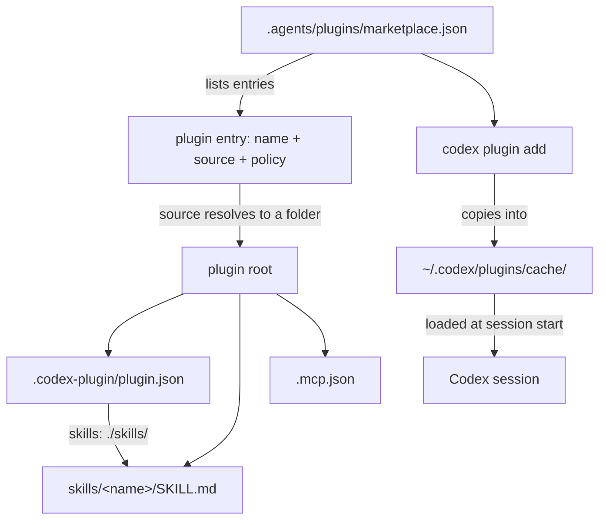

# 04. Codex CLI: skills, plugins and marketplaces

This file describes how OpenAI Codex CLI defines a skill, a plugin and a marketplace. Codex CLI is OpenAI's command-line coding agent. The one thing to know: Codex has **two different contracts** for a plugin manifest. The local runtime loader accepts more fields than the publishing validator does. Write for the stricter contract, the validator, and your plugin works on both.

Every fact here matches the official docs, the `openai/codex` source on `main`, and a local Codex CLI 0.149.1, all checked on 2026-09-03. For the same three words in Claude Code, read [02_claude-code-plugins.md](02_claude-code-plugins.md) and [03_claude-code-marketplaces.md](03_claude-code-marketplaces.md). For the shared skill format, read [07_skills-portable.md](07_skills-portable.md).

## 1. The three words

Codex uses the same three nouns as Claude Code. A skill is content. A plugin packages skills. A marketplace lists plugins.

| Word | Definition in Codex |
|---|---|
| Skill | A folder with a `SKILL.md` file. The frontmatter needs `name` and `description`. Codex loads the body when the skill is picked. |
| Plugin | A folder with a `.codex-plugin/plugin.json` manifest. It can bundle skills, MCP servers and app mappings. |
| Marketplace | A JSON catalog at `.agents/plugins/marketplace.json`. It lists plugins, their sources and their install policy. |

MCP means Model Context Protocol. It is the standard Codex uses to talk to external tool servers.



## 2. Plugin layout on disk

A plugin is a folder. Only `plugin.json` goes inside `.codex-plugin/`. Everything else sits at the plugin root.

```
my-plugin/
├── .codex-plugin/
│   └── plugin.json        # the manifest, the only required file
├── skills/
│   └── my-skill/
│       └── SKILL.md       # one folder per skill
├── .mcp.json              # optional, MCP server definitions
├── .app.json              # optional, MCP server connection mappings
└── assets/
    ├── logo.png
    └── screenshot1.png
```

Codex looks for a manifest at three paths inside a plugin root and uses the first it finds: `.codex-plugin/plugin.json`, then `.claude-plugin/plugin.json`, then `.cursor-plugin/plugin.json`. So Codex can read a Claude Code manifest directly. You still need a `.codex-plugin/plugin.json` to carry the Codex-only `interface` block.

## 3. The `plugin.json` manifest

The table lists every field. The **Status** column says whether the publishing validator accepts it. The validator is `scripts/validate_plugin.py` in the bundled `plugin-creator` skill. It mirrors the workspace plugin ingestion schema.

| Field | Type | Status |
|---|---|---|
| `name` | string, kebab-case | Required. It is the plugin identifier and the component namespace. |
| `version` | string | Required. Must be strict semver. The error text is ``plugin.json field `version` must be strict semver``. |
| `description` | string | Required. One short purpose summary. |
| `author` | object | Required. `author.name` is required. `author.email` and `author.url` are optional. `url` must be an `https://` URL. |
| `interface` | object | Required. See section 4. |
| `skills` | string or array | Optional. A relative path to the skills folder, normally `"./skills/"`. |
| `mcpServers` | string or object | Optional. A path to `.mcp.json`, or the server map written inline. |
| `apps` | string | Optional. A path to `.app.json`. Include it only when the file exists. |
| `homepage` | string | Optional. A documentation URL. |
| `repository` | string | Optional. A source code URL. |
| `license` | string | Optional. A license identifier such as `MIT`. |
| `keywords` | array of string | Optional. Search and discovery tags. |
| `id` | string | Optional. Accepted by the validator. It appears in no documentation page. Purpose **not verified**. |
| `hooks` | string, array or object | The runtime loader reads it. **The validator rejects it.** |
| `commands` | string or array | The runtime loader reads it. **The validator rejects it.** |

Path rules for `skills`, `mcpServers` and `apps`: write every path relative to the plugin root, start it with `./`, and keep it inside the root. `skills` and string-valued `mcpServers` supplement default component discovery. They do not replace it.

The runtime loader ignores `author`, `homepage`, `repository` and `license`. It reads `name`, `version`, `description`, `keywords`, `skills`, `mcpServers`, `apps`, `hooks` and `interface`. A separate function reads `commands`.

## 4. The `interface` block

The `interface` block holds presentation data. Codex shows it in the plugin browser and in ChatGPT. The validator requires five string fields plus two more.

| Field | Type | Status |
|---|---|---|
| `displayName` | string | Required. The user-facing title. |
| `shortDescription` | string | Required. A subtitle for compact views. |
| `longDescription` | string | Required. The text on the details screen. |
| `developerName` | string | Required. The publisher name. |
| `category` | string | Required. A display bucket. See section 6. |
| `capabilities` | array of string | Required by the validator. Example values are `Interactive` and `Write`. |
| `defaultPrompt` | array of string | Required by the validator. `default_prompt` is also accepted. At most 3 entries. Each entry is capped at 128 characters. Aim for about 50 characters. |
| `brandColor` | string | Optional. Must match `#RRGGBB`. |
| `websiteURL` | string | Optional. Must be an absolute `https://` URL. |
| `privacyPolicyURL` | string | Optional. Must be an absolute `https://` URL. |
| `termsOfServiceURL` | string | Optional. Must be an absolute `https://` URL. |
| `composerIcon` | string | Optional. A path to a real icon file inside the plugin. |
| `logo` | string | Optional. A path to a real logo file inside the plugin. |
| `logoDark` | string | Optional. The dark-mode logo. |
| `screenshots` | array of string | Optional. PNG files only. They must live under `./assets/`. |

A minimal manifest that passes validation:

```json
{
  "name": "meeting-follow-up",
  "version": "1.0.0",
  "description": "Turn meeting notes into decisions and next steps",
  "author": { "name": "Sid", "url": "https://example.com" },
  "license": "MIT",
  "skills": "./skills/",
  "interface": {
    "displayName": "Meeting Follow Up",
    "shortDescription": "Notes into decisions",
    "longDescription": "Reads meeting notes and writes a decision list with owners and dates.",
    "developerName": "Sid",
    "category": "Productivity",
    "capabilities": ["Interactive"],
    "defaultPrompt": ["Turn these notes into next steps."]
  }
}
```

## 5. What a Codex plugin cannot contain

Three fields are blocked at publish time. Keep them out of any plugin meant for both hosts.

- `hooks`. The validator rejects it. The error is ``plugin.json field `hooks` is not accepted by plugin validation``. The local runtime still loads it.
- `commands`. The validator rejects it. The local runtime still loads it for Claude compatibility.
- `dependencies`. The validator rejects it. Codex has no plugin dependency resolver.

One more limit is about packaging, not fields. Anything a skill needs at runtime must live inside the skill folder. Codex packages only what `"skills": "./skills/"` points at.

## 6. The marketplace file

A marketplace is one JSON file. Codex reads it from four relative paths inside a marketplace root. It uses the first file that exists.

```
.agents/plugins/marketplace.json
.agents/plugins/api_marketplace.json     # used for API-key login
.claude-plugin/marketplace.json          # legacy, Claude compatible
.cursor-plugin/marketplace.json
```

Two scopes exist. A repo marketplace lives at `$REPO_ROOT/.agents/plugins/marketplace.json`. A personal marketplace lives at `~/.agents/plugins/marketplace.json`.

### Top-level fields

A marketplace file needs two fields.

| Field | Type | Status |
|---|---|---|
| `name` | string | Required. The marketplace identifier. |
| `interface` | object | Optional. Its only field is `displayName`, a string. |
| `plugins` | array | Required. Ordered. The order sets the render order. |

### Plugin entry fields

Each entry needs a name and a source.

| Field | Type | Status |
|---|---|---|
| `name` | string | Required. It must match the plugin folder name and the `plugin.json` `name`. |
| `source` | object or string | Required. See below. A plain string is treated as a `local` path. |
| `policy` | object | Defaulted, but the spec says always write it. |
| `category` | string | Optional in code. The spec says always include it. |

Codex flattens any other key on an entry into a fallback manifest. This lets an entry carry `interface`, `description` and `keywords` for a remote plugin whose manifest is not on disk yet.

### Source types

Codex accepts four source types. All four work.

| `source` value | Fields | Notes |
|---|---|---|
| `local` | `path` required | Relative to the marketplace root. Prefix with `./`. It must stay inside the root. |
| `url` | `url` required. `path`, `ref`, `sha` optional | A Git repository. Use `path` when the plugin sits in a subfolder. |
| `git-subdir` | `url` and `path` required. `ref`, `sha` optional | A Git repository with the plugin in a subfolder. |
| `npm` | `package` required. `version`, `registry` optional | Needs the `npm` CLI. `registry` must be an HTTPS URL. |

**Non-local sources do work.** All four types resolve on Codex 0.149.1. The official `openai-curated` marketplace ships working `url` entries, and they appear in `codex plugin list`. [08_this-marketplace.md](08_this-marketplace.md) explains why this repository still exports `local` sources only.

One behaviour hides a broken entry. When Codex cannot resolve one entry's source, it writes a `warn!` log and skips that entry. It leaves the rest of the marketplace intact. The warning does not show in normal CLI output, so a bad entry looks like it vanished. The docs state the rule: "If Codex can't resolve a marketplace entry's source, it skips that plugin entry instead of failing the whole marketplace."

### Policy values

`policy` decides whether a user may install the plugin, and when Codex asks for credentials.

| Key | Allowed values | Default |
|---|---|---|
| `policy.installation` | `NOT_AVAILABLE`, `AVAILABLE`, `INSTALLED_BY_DEFAULT` | `AVAILABLE` |
| `policy.authentication` | `ON_INSTALL`, `ON_USE` | `ON_INSTALL` |
| `policy.products` | array of string | Omit it unless product gating is asked for. |

### Category buckets

There is **no category enum in the Codex source**. The validator checks only that `category` is a non-empty string. The value is a display bucket.

These ten values appear in the official `openai/plugins` marketplace, so they are the safe set: `Business & Operations`, `Communication`, `Creativity`, `Data & Analytics`, `Developer Tools`, `Education & Research`, `Finance`, `Productivity`, `Scientific Research`, `Security`.

The values `Other` and `Travel` appear in this repo's `scripts/codex-sync` comment. They appear in no OpenAI source. Treat both as **not verified**.

### A complete marketplace file

This file lists one local plugin and passes on Codex 0.149.1.

```json
{
  "name": "my-marketplace",
  "interface": { "displayName": "My Plugins" },
  "plugins": [
    {
      "name": "meeting-follow-up",
      "source": { "source": "local", "path": "./plugins/meeting-follow-up" },
      "policy": { "installation": "AVAILABLE", "authentication": "ON_INSTALL" },
      "category": "Productivity"
    }
  ]
}
```

## 7. Where Codex finds skills

Codex scans six locations, most specific first. Duplicate skill names are not merged. Both copies appear in the selector.

| Scope | Location |
|---|---|
| REPO | `$CWD/.agents/skills` |
| REPO | `$CWD/../.agents/skills`, and each parent up to the repo root |
| REPO | `$REPO_ROOT/.agents/skills` |
| USER | `$HOME/.agents/skills` |
| ADMIN | `/etc/codex/skills` |
| SYSTEM | Bundled with Codex |

Codex follows symlinked skill folders. An installed plugin's skills load from the plugin cache, not from these paths. To disable one local skill, add this to `~/.codex/config.toml` and restart Codex:

```toml
[[skills.config]]
path = "/path/to/skill/SKILL.md"
enabled = false
```

Invoke a skill in two ways. Type `$` or run `/skills` to pick one by hand. Or write a prompt that matches the skill `description` and let Codex pick it.

## 8. Commands

Verified against `codex-cli 0.149.1`.

### Marketplaces

These commands register and refresh a catalog.

```bash
codex plugin marketplace add ./local-marketplace-root
codex plugin marketplace add owner/repo
codex plugin marketplace add owner/repo --ref v2.1.0
codex plugin marketplace add https://github.com/example/plugins.git --sparse .agents/plugins
codex plugin marketplace list
codex plugin marketplace upgrade
codex plugin marketplace upgrade my-marketplace
codex plugin marketplace remove my-marketplace
```

`add` takes a local path, `owner/repo[@ref]`, an HTTPS Git URL, or an SSH Git URL. `--ref` and `--sparse` apply to Git sources only, and `--sparse` repeats.

### Plugins

These commands list, install and remove a plugin.

```bash
codex plugin list
codex plugin list --marketplace my-marketplace
codex plugin list --json
codex plugin list --available --json
codex plugin add my-plugin@my-marketplace
codex plugin add my-plugin --marketplace my-marketplace
codex plugin remove my-plugin@my-marketplace
```

`--available` adds uninstalled marketplace plugins to the JSON output.

**There is no `codex plugin update`.** The `plugin` subcommand has exactly four children: `add`, `list`, `marketplace` and `remove`. To pick up a new plugin version from a Git marketplace, run `codex plugin marketplace upgrade <name>` to refresh the snapshot.

Inside a Codex session, `/plugins` opens the plugin browser. It groups plugins by marketplace, and `Space` toggles an installed plugin on or off. New plugin skills become available when you start a new session. Codex picks up local skill folders automatically. Restart Codex after any edit to `~/.codex/config.toml`.

### Minimum version

Use Codex **0.131.0 or newer** for the marketplace CLI. The `codex plugin marketplace` commands landed in `openai/codex` PR #21396, merged 2026-05-14. The mapping from that merge to the `rust-v0.131.0` stable tag is **not verified**. Some plugin core support shipped earlier. The first version that carried `/plugins` in the terminal UI is **not verified**.

## 9. Procedure: build a plugin and a marketplace

Follow these steps in order.

1. Create the plugin folder. Name it in kebab-case. Use the tree in section 2.
2. Write one skill at `skills/<skill-name>/SKILL.md`. Give the frontmatter a `name` and a `description`. Put every file the skill needs inside that skill folder.
3. Write `.codex-plugin/plugin.json`. Copy the minimal manifest in section 4. Set `version` to a strict semver string.
4. Fill every required `interface` field. Do not skip `capabilities` or `defaultPrompt`.
5. Leave `hooks`, `commands` and `dependencies` out of the manifest.
6. Create `.agents/plugins/marketplace.json` at your repo root. Copy the example in section 6.
7. Add one entry per plugin. Write `name`, `source`, `policy` and `category` on every entry.
8. Register the marketplace: `codex plugin marketplace add ./path/to/repo-root`.
9. Confirm the catalog: `codex plugin list --available --json`. A missing entry means Codex skipped an unresolvable source.
10. Install: `codex plugin add <plugin>@<marketplace>`.
11. Start a new Codex session. Run `/skills` and check the skill is listed.

To publish to the universal plugin directory, run `python3 scripts/validate_plugin.py <plugin-path>` first. That script ships inside the `plugin-creator` skill in the Codex source tree. It also rejects leftover `[TODO: ...]` placeholders.

## 10. Where installed plugins live

Codex copies an installed plugin into a cache under `$CODEX_HOME`, which defaults to `~/.codex`. It loads the plugin from that copy, not from the marketplace entry path.

```
~/.codex/
├── plugins/
│   ├── cache/<marketplace>/<plugin>/<version>/   # the loaded copy
│   └── data/                                     # PLUGIN_DATA
├── .tmp/marketplaces/<marketplace-name>/         # Git marketplace snapshots
└── config.toml                                   # enable flags and snapshot state
```

For a `local`-sourced plugin, `<version>` is the literal string `local`. `config.toml` holds one `[plugins."<plugin>@<marketplace>"]` table with an `enabled` boolean, and one `[marketplaces.<name>]` table with `last_updated`, `last_revision`, `source_type` and `source`.

Plugin hook commands receive `PLUGIN_ROOT` and `PLUGIN_DATA`. Codex also sets `CLAUDE_PLUGIN_ROOT` and `CLAUDE_PLUGIN_DATA` for compatibility. Installing a plugin does not trust its hooks. Codex skips plugin-bundled hooks until you review and trust the current definition.

## 11. This repo

This marketplace generates its whole Codex layer from the Claude layer with `./scripts/codex-sync`. Read [08_this-marketplace.md](08_this-marketplace.md) for the generator, the overlay table and the drift check. For a side-by-side of Codex against the other hosts, read [09_comparison.md](09_comparison.md).

## Sources

- https://developers.openai.com/codex/plugins/build
- https://learn.chatgpt.com/docs/plugins
- https://learn.chatgpt.com/docs/build-plugins and https://learn.chatgpt.com/docs/build-skills
- `openai/codex` on `main`: `codex-rs/core-plugins/src/marketplace.rs`, `codex-rs/core-plugins/src/manifest.rs`, `codex-rs/exec-server-protocol/src/protocol.rs`
- `openai/codex` on `main`: `codex-rs/skills/src/assets/samples/plugin-creator/references/plugin-json-spec.md` and `.../scripts/validate_plugin.py`
- https://github.com/openai/codex/pull/21396
- https://github.com/openai/plugins
- Local `codex-cli 0.149.1`: `codex plugin --help`, `codex plugin marketplace --help`, `codex plugin list --help`
