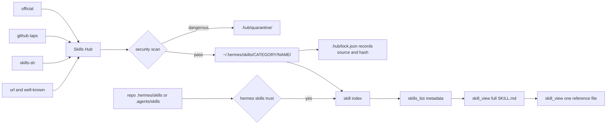

# 05. Hermes Agent

Hermes Agent is an open-source AI agent by Nous Research. This file covers how Hermes defines a skill, where skills live, how the Skills Hub distributes them, and how Hermes plugins differ from Claude Code plugins. The one thing to know: **Hermes has two separate distribution channels, not one.** The Skills Hub distributes skills. The community plugin index distributes plugins. Neither uses a marketplace manifest file the way Claude Code does. A Hermes skill registry is a plain GitHub repository of skill folders with no catalog file at all.

For the neutral definitions of skill, plugin and marketplace, see [01_concepts.md](01_concepts.md). For the portable `SKILL.md` standard, see [07_skills-portable.md](07_skills-portable.md). For a host-by-host table, see [09_comparison.md](09_comparison.md).

## 1. Vocabulary

Hermes uses its own words. This table maps each one to the generic idea.

| Hermes word | Meaning | Generic idea |
|---|---|---|
| Skill | A folder with a `SKILL.md` file. The agent loads it on demand. | Skill |
| Bundled skill | A skill that ships in the Hermes repo. The installer seeds it into your profile. | Built-in skill |
| Optional skill | A first-party skill you install on request. Its source id is `official`. | First-party opt-in skill |
| Skills Hub | The layer that searches and installs skills from eight sources. | Marketplace for skills |
| Tap | A GitHub repository of skills that you subscribe to. | Custom registry |
| Skill bundle | A YAML alias that groups several installed skills under one slash command. It installs nothing. | Preset |
| Blueprint | A skill that also declares a schedule. It becomes a suggested cron job. | Shareable automation |
| Plugin | Python code that adds tools, hooks, commands or providers. | Plugin |
| Plugin index | A static JSON catalog of community plugins. | Marketplace for plugins |
| Toolset | A named group of built-in tools, such as `web` or `terminal`. | Capability group |

The important structural point: in Claude Code a plugin contains skills. In Hermes a skill travels on its own. A plugin is Python and travels separately.

## 2. Skill anatomy

A skill is one directory. `SKILL.md` is the only required file. Everything else is optional support material.

```text
~/.hermes/skills/
├── <category>/                # grouping level, free choice of name
│   └── <skill-name>/          # this directory name is the install slug
│       ├── SKILL.md           # required
│       ├── references/        # docs loaded on demand
│       ├── templates/         # output formats
│       ├── scripts/           # helper scripts the skill calls
│       ├── examples/          # referenced example outputs
│       └── assets/            # supplementary files
├── .hub/                      # Skills Hub state
│   ├── lock.json              # install provenance
│   ├── taps.json              # subscribed taps
│   ├── quarantine/            # skills blocked by the scanner
│   └── audit.log
└── .bundled_manifest          # content hashes of seeded bundled skills
```

The category directory groups skills for display. The skill directory name is the install slug and the slash command name.

### Frontmatter fields

`SKILL.md` starts with YAML frontmatter. YAML is a plain-text data format. Only two fields are required.

| Field | Required | Meaning |
|---|---|---|
| `name` | Yes | Skill identifier. |
| `description` | Yes | What the skill does. Shown in search results. |
| `version`, `author`, `license` | No | Plain strings. Display metadata only. |
| `platforms` | No | List of `macos`, `linux`, `windows`. Hermes hides the skill on any other platform. |
| `environments` | No | List of `kanban`, `docker`, `s6`. Hermes hides the skill unless that runtime is active. An unknown tag never hides the skill. |
| `required_environment_variables` | No | List of `{name, prompt, help, required_for}`. Hermes prompts for missing values and passes them into sandboxes. |
| `required_credential_files` | No | List of `{path, description}`. Paths are relative to `~/.hermes/`. Hermes mounts existing files read-only into sandboxes. |

Hermes-only settings sit under a `metadata.hermes` block. This keeps them out of the standard field namespace.

| `metadata.hermes` field | Meaning |
|---|---|
| `tags`, `category`, `related_skills` | Classification and cross-references. |
| `requires_toolsets`, `requires_tools` | Show the skill only when those tools are present. |
| `fallback_for_toolsets`, `fallback_for_tools` | Show the skill only when those tools are absent. |
| `config` | List of `{key, description, default, prompt}`. Values persist to `config.yaml` under `skills.config.<key>`. |
| `blueprint` | `{schedule, deliver, prompt, no_agent}`. `schedule` takes a cron expression, a phrase such as `every 2h`, or an ISO timestamp. |

**Description length.** Hermes truncates the description at **60 characters** in the system-prompt skill index. The constant is `SKILL_PROMPT_DESC_LIMIT = 60` in `agent/skill_utils.py`. The full text stays in the file. Hermes cuts the index entry only. Put your trigger words first.

**Unknown fields are ignored.** `parse_frontmatter` in `agent/skill_utils.py` loads the YAML into a dictionary. The rest of the code reads known keys by name. There is no allow-list and no rejection. A Claude Code field such as `allowed-tools` or `model` is simply inert.

**No size limit.** The docs give no cap for the `SKILL.md` body. Whether Hermes enforces one in code is **not verified**.

### Body features

The house section order is `# Title`, `## When to Use`, `## Quick Reference`, `## Procedure`, `## Pitfalls`, `## Verification`.

Three body features are Hermes-only.

1. Template tokens. Hermes replaces `${HERMES_SKILL_DIR}` and `${HERMES_SESSION_ID}` when it loads the body. Set `skills.template_vars: false` to turn this off.
2. Inline shell. The form `` !`command` `` runs the command and inlines its output. This is **off by default**. Enable it with `skills.inline_shell: true`. Hermes caps the output at 4000 characters.
3. Media directives. `[[as_document]]` forces file delivery of media paths. `[[audio_as_voice]]` promotes audio to voice messages.

## 3. Where skills live and load order

Hermes reads four tiers. Higher tiers win.

| Rank | Tier | Location |
|---|---|---|
| 1 | Project | `<repo>/.hermes/skills/` and `<repo>/.agents/skills/` |
| 2 | Local | `~/.hermes/skills/` |
| 3 | External | Paths listed in `skills.external_dirs` in `config.yaml` |
| 4 | Bundled | Seeded from the Hermes repo into the local tier on install and on `hermes update` |

The docs state the order as project, then local, then `external_dirs`. The project root is the nearest ancestor directory that holds `.git`.

```yaml
# ~/.hermes/config.yaml
skills:
  external_dirs:
    - ~/.agents/skills
    - /home/shared/team-skills
  create_dir: /opt/brain/skills   # where the agent writes new skills
```

External paths expand `~` and `${VAR}`. Hermes skips a path that does not exist.

**Project skills need explicit trust.** Hermes does not auto-load them. The first run inside a repository with project skills prints a notice.

```bash
hermes skills trust     # trust the current repository, hermes skills untrust revokes it
```

Trusted roots persist in `skills.trusted_project_dirs`. Hermes security-scans every project skill before it enters the index. A `dangerous` verdict quarantines the skill. Scan results cache under `~/.hermes/cache/project_skill_scans/`, never inside your repository.

### Progressive disclosure

Progressive disclosure means the agent loads detail only when it needs it. Hermes uses three levels. `skills_list()` returns the name, description and category of every skill, at a cost of around 3000 tokens. `skill_view(name)` returns the full `SKILL.md`. `skill_view(name, path)` returns one reference file. Every installed skill also becomes a slash command `/<skill-name>`. Up to five leading skill tokens stack in one message.

## 4. The Skills Hub

The Skills Hub is the marketplace for skills. It searches eight sources through one command set.

| Source id | What it holds | Trust level |
|---|---|---|
| `official` | Hermes optional skills | official |
| `github` | Direct GitHub repositories and your taps | trusted for default taps, community otherwise |
| `skills-sh` | The Vercel skills directory | community |
| `well-known` | Sites that publish `/.well-known/skills/index.json` | community |
| `url` | A direct link to a `SKILL.md` | community |
| `clawhub` | The ClawHub marketplace | community |
| `lobehub` | LobeHub agents converted to skills | community |
| `browse-sh` | Browserbase site automation skills | community |

Hermes subscribes five GitHub taps by default, so browsing works with no setup: `openai/skills`, `anthropics/skills`, `huggingface/skills`, `NVIDIA/skills` and `garrytan/gstack`.



### Commands

One command set covers browse, install, update and publish.

```bash
hermes skills browse [--source official]              # browse, official first
hermes skills search kubernetes [--source skills-sh]  # search every source
hermes skills inspect official/security/1password     # preview before install
hermes skills install official/security/1password
hermes skills install openai/skills/k8s               # one skill, no tap needed
hermes skills install https://example.com/SKILL.md --name my-skill
hermes skills list --source hub
hermes skills check                                   # which installed skills drifted
hermes skills update [react] [--force]                # reinstall those with updates
hermes skills uninstall k8s
hermes skills audit                                   # re-scan every hub skill
hermes skills config <name>                           # set the skill's config values
hermes skills tap add|list|remove myorg/skills-repo
hermes skills publish skills/my-skill --to github --repo owner/repo
```

Every command also runs inside a session as `/skills <subcommand>`.

### Update rules

`hermes skills update` compares the on-disk content hash against the hash recorded at install. Hermes **skips** a skill you edited locally, so it never overwrites your work silently. `--force` overrides that.

Bundled skills use a different mechanism. `.bundled_manifest` records an origin hash. Hermes marks a changed local copy `user_modified` and skips it from then on. `hermes skills reset <name>` clears that flag. `--restore` also replaces your copy with the bundled version.

### Security

Every hub install passes through a built-in scanner. It looks for data exfiltration, prompt injection, destructive commands and supply-chain signals. `--force` overrides a caution or warn verdict. It never overrides a `dangerous` verdict. Trust levels rank `builtin` above `official`, above `trusted`, above `community`. Which scanner findings each level blocks is not verified. Hermes records the source URL, content hash, scanner version, findings and timestamp in `~/.hermes/skills/.hub/lock.json`.

A URL or GitHub install copies `SKILL.md` plus only the files it explicitly references under `references/`, `templates/`, `scripts/`, `assets/` and `examples/`. Unreferenced files stay behind. Put everything your skill needs inside the skill folder and reference it by name. GitHub API rate limits apply. Set `GITHUB_TOKEN` in `.env` to raise the limit from 60 to 5000 requests per hour.

## 5. Procedure: define and publish a Hermes skill

Follow these steps to write a skill and share it as a tap.

1. Create the folder. Run `mkdir -p ~/.hermes/skills/devops/deploy-k8s`. The last directory name becomes the install slug.
2. Write `SKILL.md`. Start with the frontmatter below.
3. Keep the description under 60 characters, or accept truncation in the skill index.
4. Put helper scripts in `scripts/` and long documents in `references/`. Reference each one by relative path from `SKILL.md`.
5. Test locally. Start Hermes and run `/deploy-k8s`. Hermes detects new skill folders automatically. Restart if the skill does not appear.
6. Create a public GitHub repository. Put each skill at `skills/<name>/SKILL.md`. Hermes ignores directory names that start with `.` or `_`.
7. Publish with `hermes skills publish skills/deploy-k8s --to github --repo owner/repo`, or push the repository yourself.
8. Tell users to run `hermes skills tap add owner/repo`, then `hermes skills install owner/repo/deploy-k8s`.

```yaml
---
name: deploy-k8s
description: Deploy and roll back Kubernetes workloads
version: 1.0.0
author: Your Name
license: MIT
platforms: [linux, macos]
metadata:
  hermes:
    tags: [devops, kubernetes]
    category: devops
    requires_toolsets: [terminal]
---
```

A tap needs **no manifest file**. The directory layout is the whole contract. The default tap path is `skills/`. Change it by editing `path` in `~/.hermes/skills/.hub/taps.json`. A new tap gets `community` trust. Raising that requires a pull request that edits `TRUSTED_REPOS` in `tools/skills_guard.py`. You may add an optional `skills.sh.json` file at the repository root. Its `groupings` become category labels in the Skills Hub display. It installs nothing.

## 6. Plugins: the other extension point

A Hermes plugin is Python code. It is not a container for skills, although it can register one.

```text
~/.hermes/plugins/calculator/
├── plugin.yaml     # manifest
├── __init__.py     # defines register(ctx)
├── schemas.py      # tool schemas
└── tools.py        # tool handlers
```

`plugin.yaml` requires `name`, `version` and `description`. Optional fields include `capabilities`, `requires_env`, `license`, `homepage` and `tags`.

Hermes discovers plugins from four sources. A later source overrides an earlier one on a name clash.

| Order | Source | Path |
|---|---|---|
| 1 | Bundled | `<repo>/plugins/` |
| 2 | User | `~/.hermes/plugins/` |
| 3 | Project | `./.hermes/plugins/`, requires `HERMES_ENABLE_PROJECT_PLUGINS=true` |
| 4 | pip | The `hermes_agent.plugins` entry point group |

Discovery does not mean loading. General plugins stay off until you allow-list them. The deny-list always wins.

```yaml
# ~/.hermes/config.yaml
plugins:
  enabled: [my-tool-plugin]
  disabled: [noisy-plugin]
```

`register(ctx)` exposes many extension points. The ones that matter here are `ctx.register_tool`, `ctx.register_hook`, `ctx.register_command` for a slash command, `ctx.register_cli_command` for a `hermes <plugin> <sub>` command, and `ctx.register_skill(name, path)` for a plugin-bundled skill. A plugin skill is namespaced `plugin:skill`. A plugin may register any of the 26 lifecycle events listed in `hermes_cli.plugins.VALID_HOOKS`.

### The plugin index

The plugin index is a static JSON catalog at `https://raw.githubusercontent.com/NousResearch/hermes-plugin-index/main/index.json`. Hermes caches it for 24 hours under `~/.hermes/cache/plugin_index.json` and falls back to a bundled seed, so search works offline. Submission is a pull request to `NousResearch/hermes-plugin-index`. The docs state plainly that inclusion is a metadata review only, not an audit.

```bash
hermes plugins                       # interactive UI
hermes plugins list
hermes plugins search <term> [--json] [--capability CAP] [--refresh]
hermes plugins install <name>        # bare name resolves to an index-pinned commit
hermes plugins install user/repo --ref <40-char-sha>
hermes plugins update|remove|enable|disable <name>
hermes plugins doctor [path] [--ci]
hermes plugins pack install <file>
```

`--ref` accepts only a full 40-character commit hash. A plugin pack is a `hermes-pack.yaml` file that pins a set of plugins. It also requires an exact hash for every entry. Hermes rejects tags and branches.

## 7. Agent-managed skills

Hermes calls skills its procedural memory. The agent writes them itself through a `skill_manage` tool with the actions `create`, `patch`, `edit`, `delete`, `write_file` and `remove_file`. `/learn <source>` builds a skill from a URL, a documentation directory, the conversation or pasted notes.

Gate this with `skills.write_approval: true` in `config.yaml`. The default is `false`. Staged writes wait in `~/.hermes/pending/skills/`. Review them with `/skills pending`, `/skills diff <id>`, `/skills approve <id>` and `/skills reject <id>`.

Whether the agent can trigger a Skills Hub install on its own is not verified. The documented hub path is user-operated.

## 8. Other extension points

Hermes has extension surfaces beyond skills and plugins. All are configuration, not packages. MCP below means Model Context Protocol. It is an open protocol that lets an agent call tools hosted in a separate process.

| Surface | How you configure it |
|---|---|
| MCP servers | An `mcp_servers:` block in `~/.hermes/config.yaml`. Stdio with `command`, `args`, `env`, or HTTP with `url`, `headers`. Nous also ships a curated catalog, disabled by default. |
| Gateway event hooks | A `HOOK.yaml` file plus `handler.py` in `~/.hermes/hooks/<name>/`. |
| Shell hooks | A `hooks:` block in `config.yaml`. Runs any shell command on an event. |
| Speech backends | Command templates under `tts.providers.<name>` and `stt.providers.<name>`, or a Python provider plugin. |
| Toolsets | Built-in groups such as `web`, `terminal`, `browser`, `skills`, `memory` and `cronjob`. |

## 9. Compatibility with Claude Code and Codex

A Claude Code or Codex `SKILL.md` generally works in Hermes with no edits. Three facts support that.

1. Hermes states its skills are compatible with the agentskills.io open standard.
2. Hermes required fields are `name` and `description`, a subset of what both other hosts require.
3. Hermes ignores unknown frontmatter fields, verified by reading `parse_frontmatter` in `agent/skill_utils.py`.

Hermes also reads the shared cross-tool path. It scans `<repo>/.agents/skills/` and lets you add `~/.agents/skills` to `skills.external_dirs`. One folder can serve Hermes and Codex at the same time.

### The migration command

`hermes import-agent` copies settings from another agent into Hermes.

```bash
hermes import-agent                                  # auto-detect ~/.claude or ~/.codex
hermes import-agent claude-code --dry-run
hermes import-agent codex --source /path/to/.codex
hermes import-agent claude-code --overwrite --yes
```

| Claude Code item | Hermes destination |
|---|---|
| `skills/<name>/` | `~/.hermes/skills/claude-code-imports/<name>/` |
| `CLAUDE.md` | Memory entries in `~/.hermes/memories/MEMORY.md` |
| `permissions.allow` Bash rules | `command_allowlist` in `config.yaml` |
| `permissions.deny` Bash rules | `approvals.deny` in `config.yaml` |
| `mcpServers` | `mcp_servers` in `config.yaml` |
| `commands/*.md` | Skipped with a note. Rewrite them as skills. |

Codex maps the same way. `AGENTS.md` and `memories/*.md` become memory. `[mcp_servers.*]` in `config.toml` becomes `mcp_servers`. `skills/<name>/` lands in `~/.hermes/skills/codex-imports/<name>/`. Hermes never reads `~/.claude/.credentials.json` or `~/.codex/auth.json`.

### What does not carry over

Four groups of settings do not survive a migration.

- The importer drops Claude Code slash commands. Hermes gets slash commands from skills, bundles and plugins.
- The importer reports non-Bash permission rules such as `Read(...)` or `WebFetch` as unmapped.
- A Claude Code marketplace manifest has no Hermes equivalent. A tap is a bare directory of skill folders.
- Going the other way, Hermes-only behaviour becomes inert text: `${HERMES_SKILL_DIR}` substitution, inline shell, media directives, `metadata.hermes` conditional activation, `required_environment_variables` prompting, `required_credential_files` mounting and `blueprint` scheduling.

Whether Hermes enforces the agentskills.io name constraints, such as the 64-character cap and the directory-name match, is not verified.

## Sources

- https://github.com/NousResearch/hermes-agent
- https://raw.githubusercontent.com/NousResearch/hermes-agent/main/README.md
- https://raw.githubusercontent.com/NousResearch/hermes-agent/main/website/docs/user-guide/features/skills.md
- https://raw.githubusercontent.com/NousResearch/hermes-agent/main/website/docs/developer-guide/creating-skills.md
- https://raw.githubusercontent.com/NousResearch/hermes-agent/main/website/docs/user-guide/features/plugins.md
- https://raw.githubusercontent.com/NousResearch/hermes-agent/main/website/docs/user-guide/import-from-other-agents.md
- https://raw.githubusercontent.com/NousResearch/hermes-agent/main/website/docs/reference/cli-commands.md
- https://raw.githubusercontent.com/NousResearch/hermes-agent/main/agent/skill_utils.py
- https://raw.githubusercontent.com/NousResearch/hermes-agent/main/tools/skills_hub.py
- https://hermes-agent.nousresearch.com/docs/user-guide/features/skills
- https://agentskills.io/specification
