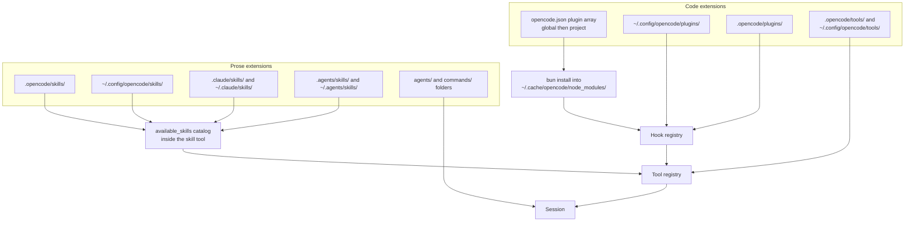

# 06. OpenCode

This file covers how OpenCode extends itself: plugins, skills, agents, commands and tools. OpenCode is an open-source terminal coding agent. The one thing to know: **an OpenCode plugin is a JavaScript or TypeScript code module with no manifest file and no version field.** OpenCode has no marketplace. Skills are the portable unit here. OpenCode reads other agents' skill folders directly, including `.claude/skills/` and `.agents/skills/`.

For neutral definitions of skill, plugin and marketplace, see [01_concepts.md](01_concepts.md). For the portable `SKILL.md` contract shared across hosts, see [07_skills-portable.md](07_skills-portable.md). For a host-by-host table, see [09_comparison.md](09_comparison.md).

The canonical repository is `anomalyco/opencode`. The older name `sst/opencode` redirects there. Verified against the GitHub API on 2026-09-03.

## 1. The five extension points

OpenCode splits extension into five named things. Only one of them runs your own code.

| Name | What it is | Runs your code |
|---|---|---|
| Tool | An action the model can perform, such as `bash`, `read` or `skill`. | Yes, for custom tools |
| Skill | A folder with a `SKILL.md` file. Prose instructions loaded on demand. | No |
| Agent | A configured assistant with its own prompt, model and tool access. | No |
| Command | A reusable prompt run in the terminal UI as `/name`. | No |
| Plugin | A JS or TS module that returns hook functions. | Yes |

A plugin is the only code-level extension point. It can subscribe to events, intercept tool calls, change shell environment variables and register custom tools.

### Built-in agents and tools

OpenCode ships two primary agents, `Build` with all tools and `Plan` with restricted read-only tools. It ships three subagents: `General`, `Explore` and `Scout`. Primary agents drive the main conversation. A primary agent invokes a subagent. You can also invoke one with an `@mention` or through the Task tool.

Built-in tools are `bash`, `edit`, `write`, `read`, `grep`, `glob`, `lsp`, `apply_patch`, `skill`, `todowrite`, `webfetch`, `websearch` and `question`.

## 2. Plugin anatomy

A plugin is a single module. It exports an async function that receives a context object and returns a hooks object.

```js
export const MyPlugin = async ({ project, client, $, directory, worktree }) => {
  return {
    "tool.execute.before": async (input, output) => {
      // inspect or block a tool call
    },
  }
}
```

The context object gives you five fields.

| Field | Meaning |
|---|---|
| `project` | Information about the current project. |
| `directory` | The current working directory. |
| `worktree` | The git worktree path. |
| `client` | The OpenCode SDK client. Use `client.app.log` for structured logs. |
| `$` | The Bun shell API for running commands. |

TypeScript authors import the type with `import type { Plugin } from "@opencode-ai/plugin"`.

**There is no plugin manifest.** OpenCode documents no `plugin.json`, no version field inside the plugin, no bundled-skills directory and no marketplace entry. This is the main structural difference from a Claude Code plugin. See [02_claude-code-plugins.md](02_claude-code-plugins.md) for that shape.

### Where a plugin lives

OpenCode loads plugins from four places. Local files come from two directories. Note the plural `plugins`.

```text
<project>/
└── .opencode/
    ├── plugins/          # project plugins, loaded automatically
    ├── skills/
    ├── agents/
    ├── commands/
    ├── tools/
    └── package.json      # only if a local plugin needs npm deps

~/.config/opencode/
├── plugins/              # global plugins, loaded automatically
├── skills/
├── agents/
├── commands/
└── tools/
```

npm packages come from the `plugin` array in `opencode.json`.

```json
{
  "$schema": "https://opencode.ai/config.json",
  "plugin": [
    "opencode-helicone-session",
    "opencode-wakatime",
    "@my-org/custom-plugin"
  ]
}
```

Scoped and unscoped package names both work.

### Install and update

OpenCode installs npm plugins with Bun at startup. It caches packages and their dependencies in `~/.cache/opencode/node_modules/`. OpenCode reads local plugins straight from the directory with no install step. A local plugin that needs npm dependencies needs a `package.json` in its config directory, for example `.opencode/package.json`. OpenCode then runs `bun install` at startup.

One CLI command installs a plugin and edits your config.

```bash
opencode plugin <module>          # alias: opencode plug <module>
opencode plugin <module> --global # write into the global config
opencode plugin <module> --force  # replace the existing plugin version
```

Update semantics beyond `--force` are **not verified**. The official docs do not state whether versions are pinned, whether a lockfile exists, or when the npm cache is refreshed.

### Load order

All four sources load. Every hook runs in sequence.

1. Global config `plugin` array
2. Project config `plugin` array
3. Global plugin directory
4. Project plugin directory

Duplicate npm packages with the same name and version load once. A local plugin and an npm plugin with similar names both load separately.

### Hooks

A plugin returns a map of event names to handlers. A generic `event` handler catches every event. The documented events are below.

| Group | Events |
|---|---|
| Command | `command.executed` |
| File | `file.edited`, `file.watcher.updated` |
| Installation | `installation.updated` |
| LSP | `lsp.client.diagnostics`, `lsp.updated` |
| Message | `message.part.removed`, `message.part.updated`, `message.removed`, `message.updated` |
| Permission | `permission.asked`, `permission.replied` |
| Server | `server.connected` |
| Session | `session.created`, `session.compacted`, `session.deleted`, `session.diff`, `session.error`, `session.idle`, `session.status`, `session.updated` |
| Todo | `todo.updated` |
| Shell | `shell.env` |
| Tool | `tool.execute.before`, `tool.execute.after` |
| TUI | `tui.prompt.append`, `tui.command.execute`, `tui.toast.show` |
| Experimental | `experimental.session.compacting` |

A plugin may also return a `tool` map to register custom tools. A plugin tool overrides a built-in tool of the same name.

### Custom tools without a plugin

You can add a tool as a plain file. Put a TS or JS file in `.opencode/tools/` or `~/.config/opencode/tools/`. The filename becomes the tool name. One file may export several named tools, which produces `<filename>_<exportname>`. Use `tool()` from `@opencode-ai/plugin` with a Zod schema for `args` and an `async execute` function. A custom tool with a built-in tool's name takes precedence over the built-in.

## 3. What OpenCode loads at startup

This diagram shows two load paths. Code extensions reach the hook and tool registries. Prose extensions reach the skill catalog.



## 4. Skills

A skill is a folder holding a `SKILL.md` file. OpenCode loads it on demand through the native `skill` tool.

### Discovery paths

OpenCode scans six locations. Two are its own, two belong to Claude Code and two are the cross-tool convention.

| Path | Scope | Owner |
|---|---|---|
| `.opencode/skills/<name>/SKILL.md` | Project | OpenCode |
| `~/.config/opencode/skills/<name>/SKILL.md` | Global | OpenCode |
| `.claude/skills/<name>/SKILL.md` | Project | Claude Code |
| `~/.claude/skills/<name>/SKILL.md` | Global | Claude Code |
| `.agents/skills/<name>/SKILL.md` | Project | Cross-tool |
| `~/.agents/skills/<name>/SKILL.md` | Global | Cross-tool |

For project paths, OpenCode walks up from the current working directory until it reaches the git worktree. It loads every match along the way.

Three environment variables switch the Claude Code paths off. Set each one to `1`.

| Variable | Effect |
|---|---|
| `OPENCODE_DISABLE_CLAUDE_CODE` | Disable all `.claude` support, prompt and skills together. |
| `OPENCODE_DISABLE_CLAUDE_CODE_PROMPT` | Disable only `~/.claude/CLAUDE.md`. |
| `OPENCODE_DISABLE_CLAUDE_CODE_SKILLS` | Disable only `.claude/skills`. |

Precedence between the six paths on a name clash is **not verified**. The docs only say to keep skill names unique across all locations.

Whether OpenCode also reads `.claude/agents/` or `.claude/commands/` is **not verified**. The env var text names prompt and skills only.

### Frontmatter

OpenCode recognises five fields. It is the Agent Skills baseline minus `allowed-tools`.

| Field | Required | Constraint |
|---|---|---|
| `name` | Yes | 1 to 64 characters. Regex `^[a-z0-9]+(-[a-z0-9]+)*$`. No leading or trailing hyphen. No `--`. Must match the containing directory name. |
| `description` | Yes | 1 to 1024 characters. |
| `license` | No | License name or a reference to a bundled license file. |
| `compatibility` | No | Environment requirements. |
| `metadata` | No | Map of string keys to string values. |

OpenCode ignores unknown frontmatter fields. They do not cause an error. This means a Claude Code skill carrying `when_to_use` or `argument-hint` still loads in OpenCode. The extra fields do nothing.

### How the model sees a skill

OpenCode lists every skill inside the description of the `skill` tool.

```xml
<available_skills>
  <skill><name>git-release</name><description>...</description></skill>
</available_skills>
```

The agent then loads one with `skill({ name: "git-release" })`. The catalog entry carries no file path. Activation goes through the tool, not through a file read.

### Permissions

Gate skills in `opencode.json` under `permission.skill`. Values are `allow`, `deny` and `ask`. Patterns support wildcards. A `deny` hides the skill from the agent completely.

```json
{
  "permission": {
    "skill": {
      "internal-*": "deny",
      "*": "allow"
    }
  }
}
```

Per-agent overrides go in agent frontmatter under `permission.skill`, or under `agent.<name>.permission` in `opencode.json`. Setting `tools: { skill: false }` for an agent disables skills and omits the `<available_skills>` block.

## 5. Agents and commands

Both are markdown files. Neither runs your code.

Define an agent in `opencode.json` under `agent`, or as a markdown file in `.opencode/agents/` or `~/.config/opencode/agents/`. The filename becomes the agent name. `review.md` creates the agent `review`. Documented options include `description`, `mode` with values `primary`, `subagent` or `all`, `model`, `temperature`, `top_p`, `disable`, `prompt`, `permission`, `hidden` and `color`. The `tools` key is marked deprecated. Any unrecognised key passes straight to the model provider as a model option.

Define a command as a markdown file in `.opencode/commands/` or `~/.config/opencode/commands/`, or as an entry under `command` in `opencode.json`. Fields are `template`, `description`, `agent`, `model` and `subtask`. In a markdown file the body is the template. The body supports `$ARGUMENTS` for all arguments, `$1` and `$2` and `$3` for positional arguments, `` !`command` `` to inject shell output, and `@path/to/file` to embed file content.

## 6. Is there a marketplace?

**No.** OpenCode has no marketplace manifest, no registry and no `opencode marketplace` command. Verified on 2026-09-03 against the official CLI and plugin docs.

The nearest official equivalent is the **Ecosystem page** at `opencode.ai/docs/ecosystem`. It is a hand-curated markdown table of community plugins, projects and agents. You add an entry by opening a pull request. It listed roughly 40 plugins on 2026-09-03. That is a count taken on the day, not a published figure.

npm is the effective registry. `opencode plugin <module>` installs an npm package and writes it into your config.

For skills, the nearest cross-host equivalent is `npx skills` from `vercel-labs/skills`. [07_skills-portable.md](07_skills-portable.md) owns the cross-host installers.

Third-party projects describing themselves as OpenCode marketplaces exist. The official docs reference none of them. Their contents are **not verified** here.

## 7. Procedure: define a plugin

Follow these steps to add a project-scoped plugin.

1. Create the directory `.opencode/plugins/` in your project root.
2. Create one file, for example `.opencode/plugins/guard.ts`.
3. Export an async function that returns a hooks object.

   ```ts
   import type { Plugin } from "@opencode-ai/plugin"

   export const Guard: Plugin = async ({ client, directory }) => {
     return {
       "tool.execute.before": async (input, output) => {
         await client.app.log({
           body: { service: "guard", level: "info", message: input.tool },
         })
       },
     }
   }
   ```

4. Add a `.opencode/package.json` only if the plugin imports npm packages. OpenCode runs `bun install` at startup.
5. Restart OpenCode. The plugin loads automatically from the directory.
6. To ship the plugin to other people, publish it to npm. Users then run `opencode plugin <package-name>`.

## 8. Procedure: define a skill

Follow these steps to add a skill that works in OpenCode and in other hosts.

1. Choose the directory. Use `.agents/skills/` for a project skill you want every compliant agent to see. Use `.opencode/skills/` for an OpenCode-only project skill.
2. Create a folder named exactly like the skill, for example `.agents/skills/git-release/`.
3. Create `SKILL.md` inside it. The filename must be all capitals.
4. Write the frontmatter. Set `name` to the folder name. Write a `description` that says what the skill does and when to use it.

   ```markdown
   ---
   name: git-release
   description: Cut a tagged release. Use when the user asks to tag, release or publish a version.
   ---

   # Git release

   ## When to use
   ...
   ```

5. Put anything the skill needs inside the same folder. Use `scripts/`, `references/` and `assets/`. Reference them with relative paths.
6. Keep `SKILL.md` short. Link the reference files instead of inlining them.
7. Restart OpenCode. Confirm the skill appears by asking the agent to list its skills.
8. If the skill does not appear, check four things: the filename is `SKILL.md` in capitals, `name` and `description` are both present, the name is unique across all six discovery paths, and no `permission.skill` rule denies it.

## Sources

- https://opencode.ai/docs/plugins
- https://opencode.ai/docs/skills
- https://opencode.ai/docs/rules
- https://opencode.ai/docs/agents
- https://opencode.ai/docs/commands
- https://opencode.ai/docs/custom-tools
- https://opencode.ai/docs/cli
- https://opencode.ai/docs/ecosystem
- https://github.com/anomalyco/opencode
- https://github.com/vercel-labs/skills
- https://agentskills.io/specification
