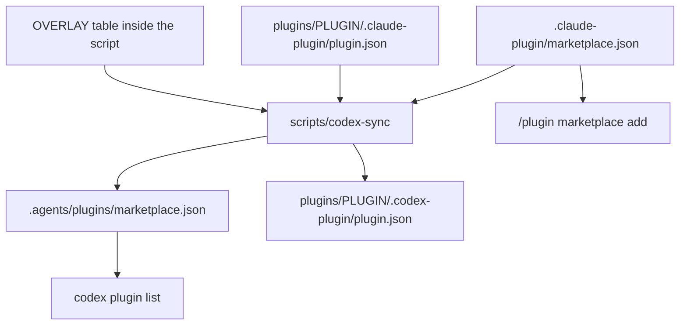

# 08. This marketplace

This file explains how the `sids-plugin-marketplace` repository works. The one thing to know: the Claude Code layer is the source of truth, and the Codex layer is generated from it by `scripts/codex-sync`. Never hand-edit a generated file. Edit the Claude manifests, then re-run the script.

For what a plugin or a marketplace is in general, read [01_concepts.md](01_concepts.md). For the full Claude Code manifest schema, read [03_claude-code-marketplaces.md](03_claude-code-marketplaces.md). For Codex manifest rules, read [04_codex.md](04_codex.md).

## 1. Repository layout

The repo holds one in-house plugin, two manifests, one generator script and a reference doc set.

```
sids-plugin-marketplace/
├── .claude-plugin/
│   └── marketplace.json          # Claude Code catalogue. SOURCE OF TRUTH.
├── .agents/
│   └── plugins/
│       └── marketplace.json      # Codex catalogue. GENERATED.
├── Documentation/                # this reference doc set
├── plugins/
│   └── project-setup/
│       ├── .claude-plugin/
│       │   └── plugin.json       # plugin manifest, Claude. SOURCE OF TRUTH.
│       ├── .codex-plugin/
│       │   └── plugin.json       # plugin manifest, Codex. GENERATED.
│       ├── skills/
│       │   └── project-setup/
│       │       ├── SKILL.md
│       │       ├── references/
│       │       └── template/
│       ├── LICENSE
│       └── README.md
├── scripts/
│   └── codex-sync                # generates the Codex layer
├── CLAUDE.md                     # agent guidance for this repo
├── README.md
├── TODO.md
└── LICENSE
```

Two plugins in the catalogue have no directory here. `agent-ks` and `uvenv` live in their own repositories. This repo only carries their catalogue entries.

## 2. The two host layers

The repo ships to two hosts. Each host reads a different pair of files. You write the Claude files by hand. The script writes the Codex files.

| Item | Claude Code path | Codex path | Who writes it |
|---|---|---|---|
| Marketplace catalogue | `.claude-plugin/marketplace.json` | `.agents/plugins/marketplace.json` | Claude by hand, Codex by script |
| Plugin manifest | `plugins/<name>/.claude-plugin/plugin.json` | `plugins/<name>/.codex-plugin/plugin.json` | Claude by hand, Codex by script |
| Skill content | `plugins/<name>/skills/<skill>/SKILL.md` | same file | by hand, shared verbatim |

Skill content is shared with no translation. `SKILL.md` frontmatter `name` and `description` work the same on both hosts. Progressive disclosure through a `references/` folder works the same on both hosts. Progressive disclosure means the skill body stays short and links to files that load only when the agent follows the link.

One packaging rule follows from this. Anything a skill needs at run time must sit inside the skill folder. The generated Codex manifest declares `"skills": "./skills/"`, and Codex packages only what that path points at.

## 3. How generation works

`scripts/codex-sync` reads the Claude layer plus a hand-written overlay table, and writes two kinds of file. Run it after any change to a plugin name, version, description, author, license, keywords or source.



Two commands:

```bash
./scripts/codex-sync            # write the generated files
./scripts/codex-sync --check    # verify they are current, exit 1 on drift
```

The script needs Python 3 only.

### What the script copies

Each Codex field comes from one place in the Claude layer.

| Codex field | Comes from |
|---|---|
| `name` | plugin name in the Claude catalogue |
| `version` | `version` in the plugin's Claude `plugin.json` |
| `description` | `shortDescription` in the `OVERLAY` entry |
| `author` | `author` in the plugin's `plugin.json`, else the catalogue entry |
| `skills` | fixed string `./skills/` |
| `interface.longDescription` | `description` in the Claude catalogue entry |
| `interface.displayName` | `displayName` in the `OVERLAY` entry |
| `interface.shortDescription` | `shortDescription` in the `OVERLAY` entry |
| `interface.developerName` | `author.name`, else the string `Sid` |
| `interface.category` | `category` in the `OVERLAY` entry |
| `license`, `homepage`, `repository` | the plugin manifest, else the catalogue entry |
| `keywords` | `keywords` in the catalogue entry |
| `policy` | fixed `AVAILABLE` plus `ON_INSTALL` |

The script stops with an error in two cases. It stops when `OVERLAY` names a plugin that the Claude catalogue does not list. It stops when the plugin has no `version` in its Claude `plugin.json`, because Codex requires strict semver.

### The OVERLAY table

Codex needs presentation fields that Claude Code has no equivalent for. Those fields live in one place, the `OVERLAY` dictionary near the top of `scripts/codex-sync`. This is the only Codex data written by hand.

```python
OVERLAY = {
    "project-setup": {
        "displayName": "Project Setup",
        "shortDescription": "Architectural conventions for any repo",
        "category": "Developer Tools",
    },
}
```

`OVERLAY` is also the export list. Only plugins named in it reach Codex. Adding a plugin to Codex means adding one `OVERLAY` entry.

`category` is a display bucket. Codex validates it only as a non-empty string. [04_codex.md](04_codex.md) lists the ten values used by the official OpenAI curated marketplace. Use one of those ten. The comment inside `codex-sync` also lists `Other` and `Travel`. Those two are **not verified** against any source.

## 4. Which plugin reaches which host

Only `project-setup` reaches Codex today. The other two plugins are Claude Code only.

| Plugin | Lives in | Claude source | On Codex |
|---|---|---|---|
| `project-setup` | this repo | `./plugins/project-setup` | yes |
| `agent-ks` | `sidhanthapoddar99/agent-knowledge-system` | `git-subdir` | no |
| `uvenv` | `sidhanthapoddar99/uvenv` | `git-subdir` | no |

The reason is the generator, not the host. `scripts/codex-sync` exits with an error when a catalogue entry has a non-string source, and it prints "Codex marketplace entries accept only local paths". So `OVERLAY` cannot carry a plugin sourced from another repo as the script stands.

The host itself is less strict. The official OpenAI curated Codex marketplace at `openai/plugins` uses a `url` source for 2 of its 64 entries, verified on 2026-09-03 by reading its `.agents/plugins/marketplace.json`. Codex accepts `local`, `url`, `git-subdir` and `npm`. The OpenAI docs also state that Codex skips an entry it cannot resolve and keeps the rest of the marketplace. See [04_codex.md](04_codex.md).

Treat the local-only rule as a choice this repo makes, not a limit Codex imposes. Two further limits are real. Codex plugin manifests carry no `commands` and no `dependencies` field through publishing validation, and the publishing validator rejects `hooks`. Keep those out of any plugin meant for both hosts.

## 5. Current state of the generated layer

`./scripts/codex-sync --check` exits 1 today. It reports:

```
codex layer is STALE. Re-run scripts/codex-sync:
  .agents/plugins/marketplace.json
```

The cause is a hand-added `agent-ks` entry in `.agents/plugins/marketplace.json` with a `url` source. `OVERLAY` does not contain `agent-ks`, so running `./scripts/codex-sync` will delete that entry. Decide first whether the entry should stay. If it should stay, the generator needs to learn remote sources. If it should go, run the script.

Two gaps also exist in the generated Codex plugin manifest. It has no `interface.capabilities` and no `interface.defaultPrompt`. The Codex publishing validator requires both. This blocks submission to the universal Codex plugin directory. It does not block local marketplace use.

## 6. Add a plugin that lives in this repo

Use this when the plugin code sits under `plugins/`.

1. Create the directory `plugins/<name>/`.
2. Write `plugins/<name>/.claude-plugin/plugin.json`. Give it `name` and `version` at minimum. `version` must be strict semver so the Codex export works.
3. Put the skill at `plugins/<name>/skills/<skill>/SKILL.md`. Keep everything the skill needs inside that folder.
4. Append an entry to the `plugins` array in `.claude-plugin/marketplace.json`:

```json
{
  "name": "my-plugin",
  "source": "./plugins/my-plugin",
  "description": "One sentence on what the plugin does",
  "license": "MIT",
  "category": "developer-tools",
  "tags": ["example"],
  "keywords": ["example"]
}
```

5. Do not set `version` in the marketplace entry. Claude Code uses the `plugin.json` value when both files set one.
6. Add one `OVERLAY` entry in `scripts/codex-sync` if the plugin should ship to Codex.
7. Run `./scripts/codex-sync`.
8. Validate and test:

```bash
claude plugin validate ./plugins/my-plugin --strict
claude --plugin-dir ./plugins/my-plugin
```

9. Run `./scripts/codex-sync --check` and confirm it exits 0.

## 7. Add a plugin that lives in another repo

Use this when the plugin sits in a subdirectory of a different repository, as `agent-ks` and `uvenv` do.

1. Append an entry to `.claude-plugin/marketplace.json` with a `git-subdir` source:

```json
{
  "name": "agent-ks",
  "source": {
    "source": "git-subdir",
    "url": "https://github.com/sidhanthapoddar99/agent-knowledge-system.git",
    "path": "plugins/agent-ks"
  },
  "description": "One sentence on what the plugin does",
  "homepage": "https://github.com/sidhanthapoddar99/agent-knowledge-system",
  "repository": "https://github.com/sidhanthapoddar99/agent-knowledge-system",
  "author": { "name": "Sidhantha Poddar" },
  "category": "knowledge-management"
}
```

2. Pin the source if you need a fixed version. Add `ref` for a branch or tag, or `sha` for a full 40-character commit. When both are present, `sha` wins.
3. Do not add an `OVERLAY` entry. The generator rejects non-string sources.
4. Run `./scripts/codex-sync --check`. It must still exit 0, because a plugin outside `OVERLAY` changes nothing on the Codex side.
5. Record the plugin in the table in `README.md`.

Other source forms exist. `github`, `url`, `npm`, `archive` and `command` are all valid Claude Code sources. See [03_claude-code-marketplaces.md](03_claude-code-marketplaces.md).

## 8. Bump a version and release

Version lives in exactly one place per plugin: the `version` field in `plugins/<name>/.claude-plugin/plugin.json`.

1. Edit `version` in `plugins/<name>/.claude-plugin/plugin.json`. Use strict semver.
2. Run `./scripts/codex-sync`. This rewrites the version in the generated Codex manifest.
3. Run `./scripts/codex-sync --check` and confirm exit 0.
4. Update the plugin table in `README.md` if the status changed.
5. Commit both layers in one commit.
6. Tag the release. The convention is `<plugin-name>--v<version>`. The double hyphen lets one repo carry independent version lines.

```bash
claude plugin tag --push
```

The manual form is equivalent:

```bash
git tag project-setup--v0.4.1
git push origin project-setup--v0.4.1
```

7. Users pick up the change with `/plugin marketplace update sids-plugin-marketplace` on Claude Code, and `codex plugin marketplace upgrade sids-plugin-marketplace` on Codex.

Tag resolution applies to git-backed sources only.

## 9. How a user installs from this marketplace

Registering a marketplace installs nothing. It only adds the catalogue. Installing a plugin is a second step.

### Claude Code

Run these commands inside a Claude Code session.

```
/plugin marketplace add sidhanthapoddar99/sids-plugin-marketplace
/plugin install project-setup@sids-plugin-marketplace
/plugin install agent-ks@sids-plugin-marketplace
/plugin install uvenv@sids-plugin-marketplace
```

Pin the catalogue to a ref with a `#` suffix:

```
/plugin marketplace add sidhanthapoddar99/sids-plugin-marketplace#v1.0
```

The same work from a shell:

```bash
claude plugin marketplace add sidhanthapoddar99/sids-plugin-marketplace
claude plugin install project-setup@sids-plugin-marketplace --scope user
claude plugin list
```

Verified against Claude Code 2.1.259.

### Codex CLI

Run these commands in your shell.

```bash
codex plugin marketplace add sidhanthapoddar99/sids-plugin-marketplace
codex plugin add project-setup@sids-plugin-marketplace
codex plugin list
```

Start a new Codex session after installing. That is when Codex picks up new skills.

Codex has no `codex plugin update` command. To pick up a new version, refresh the catalogue snapshot:

```bash
codex plugin marketplace upgrade sids-plugin-marketplace
```

Verified against codex-cli 0.149.1. Use Codex 0.131.0 or newer for the marketplace commands. [04_codex.md](04_codex.md) states what part of that version claim is **not verified**.

## 10. Rules for agents working in this repo

Five rules keep the two layers honest.

1. Never hand-edit `.agents/plugins/marketplace.json` or any `.codex-plugin/plugin.json`.
2. Re-run `./scripts/codex-sync` after any change to a plugin name, version, description, author, license, keywords or source.
3. Run `./scripts/codex-sync --check` before you commit. It exits non-zero on drift.
4. Set `version` in `plugin.json` only. Never in the marketplace entry as well.
5. Keep everything a skill needs inside the skill folder.

## Sources

- https://code.claude.com/docs/en/plugin-marketplaces
- https://code.claude.com/docs/en/plugins
- https://code.claude.com/docs/en/plugins-reference
- https://code.claude.com/docs/en/discover-plugins
- https://developers.openai.com/codex/plugins/build
- https://learn.chatgpt.com/docs/plugins
- https://learn.chatgpt.com/docs/build-plugins
- https://github.com/openai/plugins, file `.agents/plugins/marketplace.json`
- https://github.com/openai/codex, file `codex-rs/core-plugins/src/marketplace.rs`
- In-repo files read on 2026-09-03. `.claude-plugin/marketplace.json`, `.agents/plugins/marketplace.json`, `scripts/codex-sync`, `plugins/project-setup/.claude-plugin/plugin.json`, `plugins/project-setup/.codex-plugin/plugin.json`, `README.md`
- Local tool versions: Claude Code 2.1.259, codex-cli 0.149.1
