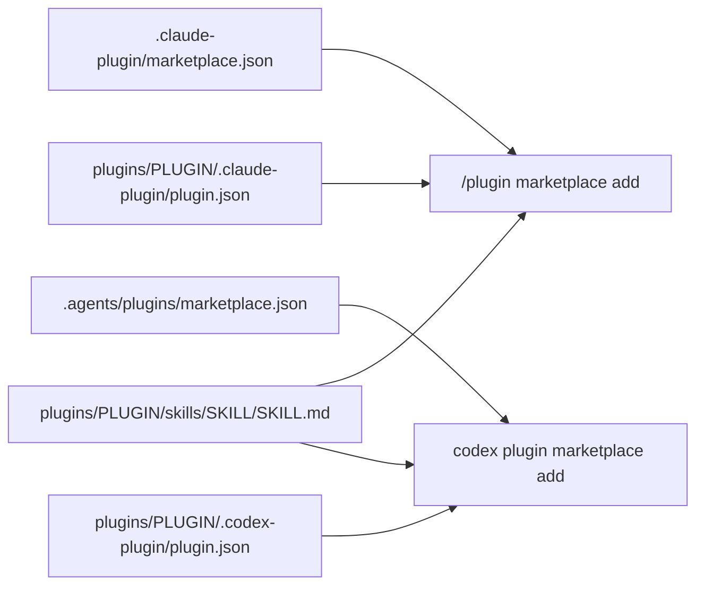

# 08. This marketplace

This file explains how the `sids-plugin-marketplace` repository works. The one thing to know: the repo ships to two hosts, and both host layers are written by hand. When you change one layer, change the other in the same commit. There is no generator.

For what a plugin or a marketplace is in general, read [01_concepts.md](01_concepts.md). For the full Claude Code manifest schema, read [03_claude-code-marketplaces.md](03_claude-code-marketplaces.md). For Codex manifest rules, read [04_codex.md](04_codex.md).

## 1. Repository layout

The repo holds one in-house plugin, two catalogues and a reference doc set.

```
sids-plugin-marketplace/
├── .claude-plugin/
│   └── marketplace.json          # Claude Code catalogue
├── .agents/
│   └── plugins/
│       └── marketplace.json      # Codex catalogue
├── Documentation/                # this reference doc set
├── plugins/
│   └── project-setup/
│       ├── .claude-plugin/
│       │   └── plugin.json       # plugin manifest, Claude
│       ├── .codex-plugin/
│       │   └── plugin.json       # plugin manifest, Codex
│       ├── skills/
│       │   └── project-setup/
│       │       ├── SKILL.md
│       │       ├── references/
│       │       └── template/
│       ├── LICENSE
│       └── README.md
├── CLAUDE.md                     # agent guidance for this repo
├── README.md
├── TODO.md
└── LICENSE
```

Two plugins in the catalogue have no directory here. `agent-ks` and `uvenv` live in their own repositories. This repo only carries their catalogue entries.

## 2. The two host layers

Each host reads a different pair of files. You write all of them by hand.

| Item | Claude Code path | Codex path |
|---|---|---|
| Marketplace catalogue | `.claude-plugin/marketplace.json` | `.agents/plugins/marketplace.json` |
| Plugin manifest, in-repo plugin | `plugins/<name>/.claude-plugin/plugin.json` | `plugins/<name>/.codex-plugin/plugin.json` |
| Plugin manifest, plugin in another repo | that repo's `.claude-plugin/plugin.json` | inline `interface` on the Codex catalogue entry |
| Skill content | `plugins/<name>/skills/<skill>/SKILL.md` | same file |



Skill content is shared with no translation. `SKILL.md` frontmatter `name` and `description` work the same on both hosts. Progressive disclosure through a `references/` folder works the same on both hosts. Progressive disclosure means the skill body stays short and links to files that load only when the agent follows the link.

One packaging rule follows from this. Anything a skill needs at run time must sit inside the skill folder. The Codex manifest declares `"skills": "./skills/"`, and Codex packages only what that path points at.

## 3. How the two catalogues map

Each Codex field has one Claude counterpart. Keep them equal.

| Codex field | Claude counterpart |
|---|---|
| entry `name` | entry `name` in the Claude catalogue |
| `source` `local` with `path` | a relative-path string source |
| `source` `url` with `url` and `path` | a `git-subdir` source. Copy `ref` or `sha` if set |
| `policy` | none. Always `{"installation": "AVAILABLE", "authentication": "ON_INSTALL"}` |
| `category` | none. Use one of the ten official display buckets in [04_codex.md](04_codex.md) |
| `interface.displayName`, `interface.shortDescription` | none. Codex-only presentation, written inline for remote plugins |
| `.codex-plugin/plugin.json` `version` | `.claude-plugin/plugin.json` `version`. Must be equal and strict semver |
| `.codex-plugin/plugin.json` `description`, `author`, `license`, `keywords` | the same fields in the Claude manifest or catalogue entry |
| `.codex-plugin/plugin.json` `interface` | none. Codex-only. `longDescription` copies the Claude catalogue `description` |

A Codex marketplace entry accepts four known keys: `name`, `source`, `policy`, `category`. Codex collects every other key on the entry into a fallback `plugin.json`. Verified in `codex-rs/core-plugins/src/marketplace.rs`, struct `RawMarketplaceManifestPlugin`, where the extra keys are a flattened map. Codex uses that fallback for listing a remote plugin, and at install only when the fetched repo has no manifest of its own. A real manifest always wins.

The official OpenAI marketplace uses this pattern. Its remote entries carry `interface.displayName` and nothing else beyond the four known keys. This repo does the same, plus `shortDescription`.

## 4. Which plugin reaches which host

All three plugins reach both hosts.

| Plugin | Lives in | Claude source | Codex source | Codex manifest |
|---|---|---|---|---|
| `project-setup` | this repo | relative path | `local` | `plugins/project-setup/.codex-plugin/plugin.json` |
| `agent-ks` | `sidhanthapoddar99/agent-knowledge-system` | `git-subdir` | `url` with `path` | inline on the catalogue entry, then the remote repo's `.claude-plugin/plugin.json` at install |
| `uvenv` | `sidhanthapoddar99/uvenv` | `git-subdir` | `url` with `path` | same |

Codex looks for a manifest at `.codex-plugin/plugin.json`, then `.claude-plugin/plugin.json`, then `.cursor-plugin/plugin.json`. So a remote plugin with only a Claude manifest still installs on Codex. See [04_codex.md](04_codex.md).

Two limits remain. Codex plugin manifests carry no `commands` and no `dependencies` field through publishing validation, and the publishing validator rejects `hooks`. Keep those out of any plugin meant for both hosts.

## 5. Sync checklist

Walk this list after any change to a plugin's name, version, description, author, license, keywords or source.

1. `version` is equal in `.claude-plugin/plugin.json` and `.codex-plugin/plugin.json`.
2. Every entry in the Codex catalogue has an entry with the same `name` in the Claude catalogue.
3. Each Codex `source` is the mapped form of the Claude `source` in section 3.
4. Every Codex entry has `policy` and `category`.
5. Every remote Codex entry has `interface.displayName`.
6. Both catalogue files parse as JSON.

```bash
python3 -m json.tool .claude-plugin/marketplace.json > /dev/null
python3 -m json.tool .agents/plugins/marketplace.json > /dev/null
claude plugin validate .
```

`claude plugin validate` checks the Claude layer only. Codex has no offline validator for a marketplace file. To confirm the Codex layer, register the repo and list it:

```bash
codex plugin marketplace add .
codex plugin list --available --json
```

A missing plugin in that output means Codex skipped an entry it could not resolve. It logs a warning and hides the entry, so check the count.

## 6. Add a plugin that lives in this repo

Use this when the plugin code sits under `plugins/`.

1. Create the directory `plugins/<name>/`.
2. Write `plugins/<name>/.claude-plugin/plugin.json`. Give it `name` and `version` at minimum. `version` must be strict semver.
3. Put the skill at `plugins/<name>/skills/<skill>/SKILL.md`. Keep everything the skill needs inside that folder.
4. Append an entry to the `plugins` array in `.claude-plugin/marketplace.json`:

```json
{
  "name": "my-plugin",
  "source": "./plugins/my-plugin",
  "description": "One sentence on what the plugin does",
  "license": "MIT",
  "category": "developer-tools",
  "tags": ["example"],
  "keywords": ["example"]
}
```

5. Do not set `version` in the marketplace entry. Claude Code uses the `plugin.json` value when both files set one.
6. Write `plugins/<name>/.codex-plugin/plugin.json`. Copy `plugins/project-setup/.codex-plugin/plugin.json` and change the values. Keep `version` equal to the Claude manifest.
7. Append an entry to `.agents/plugins/marketplace.json`:

```json
{
  "name": "my-plugin",
  "source": { "source": "local", "path": "./plugins/my-plugin" },
  "policy": { "installation": "AVAILABLE", "authentication": "ON_INSTALL" },
  "category": "Developer Tools"
}
```

8. Validate and test:

```bash
claude plugin validate ./plugins/my-plugin --strict
claude --plugin-dir ./plugins/my-plugin
```

9. Walk the checklist in section 5.

## 7. Add a plugin that lives in another repo

Use this when the plugin sits in a subdirectory of a different repository, as `agent-ks` and `uvenv` do.

1. Append an entry to `.claude-plugin/marketplace.json` with a `git-subdir` source:

```json
{
  "name": "agent-ks",
  "source": {
    "source": "git-subdir",
    "url": "https://github.com/sidhanthapoddar99/agent-knowledge-system.git",
    "path": "plugins/agent-ks"
  },
  "description": "One sentence on what the plugin does",
  "homepage": "https://github.com/sidhanthapoddar99/agent-knowledge-system",
  "repository": "https://github.com/sidhanthapoddar99/agent-knowledge-system",
  "author": { "name": "Sidhantha Poddar" },
  "category": "knowledge-management"
}
```

2. Pin the source if you need a fixed version. Add `ref` for a branch or tag, or `sha` for a full 40-character commit. When both are present, `sha` wins.
3. Append the mapped entry to `.agents/plugins/marketplace.json`. Leave it out to keep the plugin Claude Code only.

```json
{
  "name": "agent-ks",
  "source": {
    "source": "url",
    "url": "https://github.com/sidhanthapoddar99/agent-knowledge-system.git",
    "path": "plugins/agent-ks"
  },
  "policy": { "installation": "AVAILABLE", "authentication": "ON_INSTALL" },
  "category": "Developer Tools",
  "interface": { "displayName": "Agent KS", "shortDescription": "One line" }
}
```

4. Copy `ref` or `sha` into the Codex source if you set one on the Claude side.
5. Record the plugin in the table in `README.md`.
6. Walk the checklist in section 5.

Other source forms exist. `github`, `url`, `npm`, `archive` and `command` are all valid Claude Code sources. See [03_claude-code-marketplaces.md](03_claude-code-marketplaces.md). Codex accepts `local`, `url`, `git-subdir` and `npm`. See [04_codex.md](04_codex.md).

## 8. Bump a version and release

Version lives in two files per in-repo plugin, and they must match.

1. Edit `version` in `plugins/<name>/.claude-plugin/plugin.json`. Use strict semver.
2. Edit `version` in `plugins/<name>/.codex-plugin/plugin.json` to the same value.
3. Update the plugin table in `README.md` if the status changed.
4. Commit both layers in one commit.
5. Tag the release. The convention is `<plugin-name>--v<version>`. The double hyphen lets one repo carry independent version lines.

```bash
claude plugin tag --push
```

The manual form is equivalent:

```bash
git tag project-setup--v0.4.1
git push origin project-setup--v0.4.1
```

6. Users pick up the change with `/plugin marketplace update sids-plugin-marketplace` on Claude Code, and `codex plugin marketplace upgrade sids-plugin-marketplace` on Codex.

Tag resolution applies to git-backed sources only.

## 9. How a user installs from this marketplace

Registering a marketplace installs nothing. It only adds the catalogue. Installing a plugin is a second step.

### Claude Code

Run these commands inside a Claude Code session.

```
/plugin marketplace add sidhanthapoddar99/sids-plugin-marketplace
/plugin install project-setup@sids-plugin-marketplace
/plugin install agent-ks@sids-plugin-marketplace
/plugin install uvenv@sids-plugin-marketplace
```

Pin the catalogue to a ref with a `#` suffix:

```
/plugin marketplace add sidhanthapoddar99/sids-plugin-marketplace#v1.0
```

The same work from a shell:

```bash
claude plugin marketplace add sidhanthapoddar99/sids-plugin-marketplace
claude plugin install project-setup@sids-plugin-marketplace --scope user
claude plugin list
```

Verified against Claude Code 2.1.259.

### Codex CLI

Run these commands in your shell.

```bash
codex plugin marketplace add sidhanthapoddar99/sids-plugin-marketplace
codex plugin add project-setup@sids-plugin-marketplace
codex plugin add agent-ks@sids-plugin-marketplace
codex plugin add uvenv@sids-plugin-marketplace
codex plugin list
```

Start a new Codex session after installing. That is when Codex picks up new skills.

Codex has no `codex plugin update` command. To pick up a new version, refresh the catalogue snapshot:

```bash
codex plugin marketplace upgrade sids-plugin-marketplace
```

Verified against codex-cli 0.149.1. Use Codex 0.131.0 or newer for the marketplace commands. [04_codex.md](04_codex.md) states what part of that version claim is **not verified**.

## 10. Rules for agents working in this repo

Four rules keep the two layers honest.

1. Edit both host layers in the same change. Never one without the other.
2. Walk the checklist in section 5 before you commit.
3. Set `version` in `plugin.json` only. Never in the marketplace entry as well.
4. Keep everything a skill needs inside the skill folder.

## Sources

- https://code.claude.com/docs/en/plugin-marketplaces
- https://code.claude.com/docs/en/plugins
- https://code.claude.com/docs/en/plugins-reference
- https://code.claude.com/docs/en/discover-plugins
- https://developers.openai.com/codex/plugins/build
- https://learn.chatgpt.com/docs/plugins
- https://learn.chatgpt.com/docs/build-plugins
- https://github.com/openai/plugins, file `.agents/plugins/marketplace.json`
- https://github.com/openai/codex, files `codex-rs/core-plugins/src/marketplace.rs` and `codex-rs/core-plugins/src/store.rs`
- In-repo files read on 2026-09-04. `.claude-plugin/marketplace.json`, `.agents/plugins/marketplace.json`, `plugins/project-setup/.claude-plugin/plugin.json`, `plugins/project-setup/.codex-plugin/plugin.json`, `README.md`
- Local tool versions: Claude Code 2.1.259, codex-cli 0.149.1
