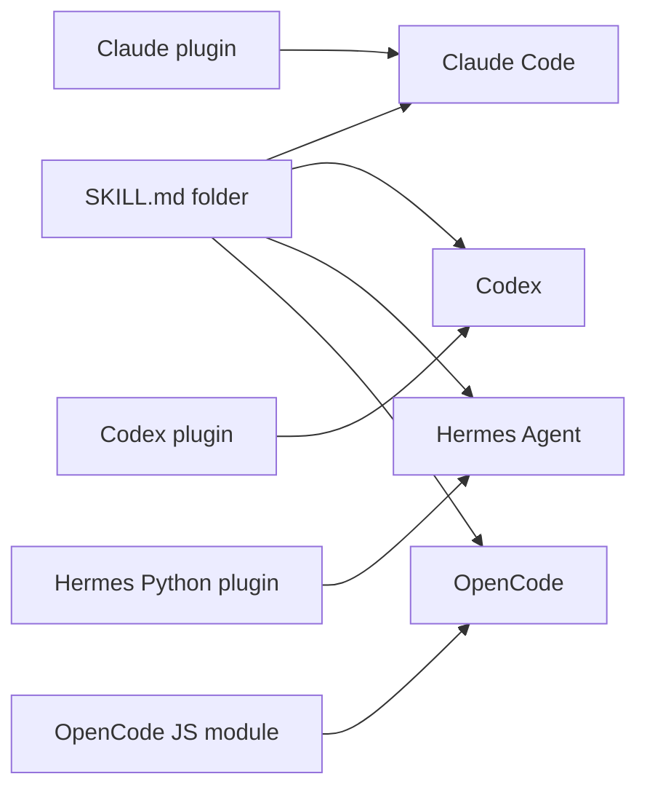

# 09. Comparison of the four hosts

This file compares Claude Code, Codex, Hermes Agent and OpenCode side by side. The one thing to know: **only the skill is portable**. A skill is a folder with a `SKILL.md` file. Every host in this table loads one. Plugins and marketplaces are host-specific, so a plugin written for one host does not run on another. Detail for each host lives in [02_claude-code-plugins.md](02_claude-code-plugins.md), [03_claude-code-marketplaces.md](03_claude-code-marketplaces.md), [04_codex.md](04_codex.md), [05_hermes.md](05_hermes.md) and [06_opencode.md](06_opencode.md). The portable skill contract lives in [07_skills-portable.md](07_skills-portable.md).

Terms used below. A **plugin** is a host-specific bundle that adds capability to one agent product. A **marketplace** is a catalog file that lists installable plugins and their sources. A **hook** is a command the host runs on a lifecycle event. **MCP** is the Model Context Protocol, a standard for connecting external tool servers. **LSP** is the Language Server Protocol, used for code intelligence. A **subagent** is a second model thread the main agent can call. **Semver** is semantic versioning, the `MAJOR.MINOR.PATCH` format.

Versions checked on 2026-09-03: Claude Code 2.1.259, `codex-cli` 0.149.1. The Hermes Agent and OpenCode facts come from their official docs, not from a local install.

## 1. Terminology map

Each host uses different words for the same three ideas. This table maps them.

| Idea | Claude Code | Codex | Hermes Agent | OpenCode |
|---|---|---|---|---|
| Portable instruction folder | Skill | Skill | Skill | Skill |
| Host bundle | Plugin | Plugin | Plugin, Python code | Plugin, JS or TS module |
| Catalog of bundles | Marketplace | Marketplace | Community plugin index | None. Ecosystem page only |
| Catalog of skills | Marketplace entry | Marketplace entry | Skills Hub | None |
| Subscribed skill source | Marketplace | Marketplace | Tap, a GitHub repo of skills | None |
| Named skill group | Not applicable | Not applicable | Skill bundle | Not applicable |
| Slash-invoked prompt | Skill. Commands merged into skills | Skill, typed as `$name` | Skill or bundle | Command |
| Event handler | Hook | Hook | Hook, 26 lifecycle events | Plugin hook function |

## 2. Manifest file path

The manifest is the file that declares a plugin. Codex reads three manifest paths, so a Claude Code plugin folder is already visible to it.

| Host | Plugin manifest path | Required |
|---|---|---|
| Claude Code | `.claude-plugin/plugin.json` | No. Optional when components sit in default folders |
| Codex | `.codex-plugin/plugin.json`, `.claude-plugin/plugin.json`, `.cursor-plugin/plugin.json` | Yes, one of the three |
| Hermes Agent | `plugin.yaml` at the plugin root | Yes |
| OpenCode | None. A plugin is a JS or TS module | Not applicable |

Codex may also read a root `plugin.json` that carries an Agent Plugins v1 `$schema` value. No official OpenAI page states this, so treat it as **not verified**.

## 3. Marketplace file path

Only Claude Code and Codex have a marketplace file. Hermes distributes skills and plugins through two separate channels. OpenCode has no catalog of its own.

| Host | Marketplace exists | Path |
|---|---|---|
| Claude Code | Yes | `.claude-plugin/marketplace.json` |
| Codex | Yes | `.agents/plugins/marketplace.json`. Also `.agents/plugins/api_marketplace.json`, `.claude-plugin/marketplace.json`, `.cursor-plugin/marketplace.json` |
| Hermes Agent | Partly | Skills: a tap is a plain GitHub repo with `skills/<name>/SKILL.md` and no manifest. Plugins: one static JSON at `https://raw.githubusercontent.com/NousResearch/hermes-plugin-index/main/index.json` |
| OpenCode | No | npm is the registry. The Ecosystem docs page is a hand-curated table |

Codex reads a repo marketplace at `$REPO_ROOT/.agents/plugins/marketplace.json` and a personal one at `~/.agents/plugins/marketplace.json`.

## 4. Supported source types

A source tells the host where to fetch a plugin. Claude Code supports the widest set.

| Source kind | Claude Code | Codex | Hermes Agent | OpenCode |
|---|---|---|---|---|
| Local relative path | Yes, `./path` | Yes, `local` | Not applicable | Yes, plugin folder |
| GitHub `owner/repo` | Yes, `github` | Yes, shorthand for `url` | Yes, skills and plugins | No |
| Git URL | Yes, `url` | Yes, `url` | No | No |
| Git subdirectory | Yes, `git-subdir` | Yes, `git-subdir` | Yes, `owner/repo/skills/name` | No |
| npm package | Yes, `npm` | Yes, `npm` | No | Yes, the only route |
| Archive URL | Yes, `archive`, from v2.1.224 | No | No | No |
| Shell command | Yes, `command`, from v2.1.229 | No | No | No |
| Plain URL to `SKILL.md` | No | No | Yes, skills only | No |

Codex resolves `url`, `git-subdir` and `npm` sources today. The claim in this repo's `CLAUDE.md` that Codex accepts only `local` sources is out of date for `codex-cli` 0.149.1. The repo generator `scripts/codex-sync` still enforces local-only. See [04_codex.md](04_codex.md) and [08_this-marketplace.md](08_this-marketplace.md).

## 5. What a plugin may contain

This grid answers what each host's plugin format can carry. "Code" means the plugin ships executable logic that the host loads directly.

| Component | Claude Code | Codex | Hermes Agent | OpenCode |
|---|---|---|---|---|
| Skills | Yes | Yes | Yes, via `register_skill` | No |
| Commands | Yes, legacy `commands/*.md` | Runtime yes, publishing validator rejects | Yes, via `register_command` | No |
| Agents | Yes, `agents/*.md` | Not verified. Folder exists in the openai/plugins layout | Not verified | No |
| Hooks | Yes, `hooks/hooks.json` | Runtime yes, publishing validator rejects | Yes, 26 events | Yes, the main surface |
| MCP servers | Yes, `.mcp.json` | Yes, `.mcp.json` and `.app.json` | Config only, not bundled in the plugin | No |
| LSP servers | Yes, `.lsp.json` | No | No | No |
| Code plugins | No | No | Yes, Python | Yes, JS or TS |
| Custom tools | Only through MCP | Only through MCP | Yes, `register_tool` | Yes, `tool()` |
| Background monitors | Yes, `monitors/monitors.json` | No | No | No |
| Executables on PATH | Yes, `bin/` | No | No | No |

Codex has two contracts. The local runtime loader accepts `hooks` and `commands`. The publishing validator `validate_plugin.py` has a hard allow-list and rejects `hooks`, `commands` and `dependencies`. Keep those keys out of any plugin you want to publish.

## 6. Skill discovery paths

All four hosts scan folders on disk. Three of them scan the shared `.agents/skills/` convention.

| Host | Project paths | User paths | Other |
|---|---|---|---|
| Claude Code | `.claude/skills/<name>/SKILL.md`, plus nested `.claude/skills/` folders below the working directory | `~/.claude/skills/<name>/SKILL.md` | Plugin `skills/<name>/`, managed enterprise folder, `~/.claude/skills/synced/` for skills synced from a claude.ai account |
| Codex | `$CWD/.agents/skills`, each parent up to the repo root, `$REPO_ROOT/.agents/skills` | `$HOME/.agents/skills` | `/etc/codex/skills` for admins, plus skills bundled with Codex |
| Hermes Agent | `<root>/.hermes/skills/`, `<root>/.agents/skills/` | `~/.hermes/skills/` | `skills.external_dirs` in `config.yaml`, plus bundled skills |
| OpenCode | `.opencode/skills/`, `.claude/skills/`, `.agents/skills/` | `~/.config/opencode/skills/`, `~/.claude/skills/`, `~/.agents/skills/` | Walks up to the git worktree root |

Claude Code does not read `.agents/skills/`. No official page states that it does. Treat any claim that it does as not verified.

Hermes does not auto-load project skills. Run `hermes skills trust` in the repo first. Every project skill is security-scanned before it enters the index.

OpenCode reads Claude Code paths by default. Three environment variables turn that off. [06_opencode.md](06_opencode.md) lists them.

## 7. Install, update and remove

This table groups commands by host. Only Claude Code and Hermes have a first-class update command for a single plugin.

| Action | Claude Code | Codex | Hermes Agent | OpenCode |
|---|---|---|---|---|
| Add catalog | `claude plugin marketplace add <source>` | `codex plugin marketplace add <source>` | `hermes skills tap add <owner/repo>` | Not applicable |
| Install | `claude plugin install <plugin>@<marketplace>` | `codex plugin add <plugin>@<marketplace>` | `hermes skills install <id>`, `hermes plugins install <name>` | `opencode plugin <module>` |
| Update one | `claude plugin update <plugin>` | None. Run `codex plugin marketplace upgrade <name>` | `hermes skills update <name>`, `hermes plugins update <name>` | Not documented. Not verified |
| Update all | `claude plugin update` | `codex plugin marketplace upgrade` | `hermes skills update` | Not documented. Not verified |
| Remove | `claude plugin uninstall <plugin>@<marketplace>` | `codex plugin remove <plugin>@<marketplace>` | `hermes skills uninstall <name>`, `hermes plugins remove <name>` | Edit the `plugin` array in `opencode.json` |
| List | `claude plugin list` | `codex plugin list` | `hermes skills list`, `hermes plugins list` | Not documented. Not verified |
| Interactive | `/plugin` | `/plugins` | `hermes plugins`, `hermes skills browse` | Not applicable |

`codex plugin --help` on 0.149.1 lists exactly four subcommands: `add`, `list`, `marketplace`, `remove`. There is no `codex plugin update`.

Removing a Claude Code marketplace also uninstalls the plugins you installed from it.

## 8. On-disk install location

Both Claude Code and Codex copy the plugin into a cache and load it from there, not from the source folder.

| Host | Payload location | State files |
|---|---|---|
| Claude Code | `~/.claude/plugins/cache/<marketplace>/<plugin>/<version>/` | `~/.claude/plugins/installed_plugins.json`, `known_marketplaces.json`, `data/<plugin-id>/` |
| Codex | `~/.codex/plugins/cache/<marketplace>/<plugin>/<version>/` | `~/.codex/config.toml`, marketplace snapshots in `~/.codex/.tmp/marketplaces/<name>/` |
| Hermes Agent | `~/.hermes/skills/<category>/<skill>/`, `~/.hermes/plugins/<name>/` | `~/.hermes/skills/.hub/lock.json`, `plugins/.install-metadata.json` |
| OpenCode | `~/.cache/opencode/node_modules/` for npm plugins. Local plugins load in place | `opencode.json` `plugin` array |

For a Codex plugin installed from a `local` source, the version folder is the literal string `local`.

## 9. Scope levels

Scope decides who sees a plugin or skill. Claude Code has the most levels.

| Host | Levels, highest precedence first |
|---|---|
| Claude Code | Managed, command line `--settings`, project local `.claude/settings.local.json`, project `.claude/settings.json`, user `~/.claude/settings.json` |
| Claude Code skills | Enterprise, personal, project. Plugin skills are namespaced and never clash |
| Codex | Repo `.agents/`, user `~/.agents/`, admin `/etc/codex/skills`, system bundled |
| Hermes Agent | Project, local `~/.hermes/skills/`, external dirs, bundled |
| OpenCode | Project `.opencode/`, global `~/.config/opencode/`. Collision winner not verified |

Codex does not merge duplicate skill names across scopes. Both copies appear in the selector.

## 10. Versioning rules

Version handling differs enough to break a shared release process.

| Host | Rule |
|---|---|
| Claude Code | Resolution order: `plugin.json` `version`, then the marketplace entry `version`, then the marketplace's own resolution such as a git tag, then `0.0.0`. Set the version in one place only. See [03_claude-code-marketplaces.md](03_claude-code-marketplaces.md) |
| Claude Code tags | `{plugin-name}--v{version}`, for example `secrets-vault--v2.1.0`. Create with `claude plugin tag --push` |
| Codex | `version` must be strict semver. The publishing validator rejects anything else. Local-source plugins are cached as version `local` |
| Hermes Agent | `version` in `SKILL.md` is optional metadata. Updates compare a content hash, not a version. Locally edited skills are skipped unless you pass `--force`. Plugin packs pin a full 40-character commit SHA |
| OpenCode | npm handles versions. A plugin has no version field of its own. Pinning and lockfile behaviour are not documented. Not verified |

## 11. Trust model

Each host states its own trust position in one line.

| Host | Trust model |
|---|---|
| Claude Code | Plugins run arbitrary code with your user privileges. Install only from sources you trust. Managed settings can allowlist marketplaces with `strictKnownMarketplaces` |
| Codex | Installing or enabling a plugin does not trust its hooks. Codex skips plugin-bundled hooks until you review and trust the current definition |
| Hermes Agent | Every hub install runs a built-in security scanner. Trust levels are `builtin`, `official`, `trusted`, `community`. `--force` overrides a warning but never a `dangerous` verdict |
| OpenCode | No stated trust gate. A plugin is a JS module loaded at startup with full host access |

## 12. What ports cleanly and what does not

Read this before you plan a multi-host release.

Ports cleanly:

- A `SKILL.md` folder with only `name` and `description` in the frontmatter. All four hosts load it.
- `references/`, `scripts/`, `assets/` beside `SKILL.md`, referenced by relative path. All four hosts support progressive disclosure of those files.
- A skill placed in `.agents/skills/`. Codex, Hermes and OpenCode all read it. Claude Code does not.
- Plain markdown instructions with no host-specific tokens.

Does not port:

- Plugins. Each host has its own manifest, its own component set and its own loader. There is no shared plugin format.
- Marketplaces. Claude Code and Codex use different files, different field names and different source shapes. Hermes and OpenCode have no equivalent.
- Claude Code frontmatter beyond the six standard fields. `when_to_use`, `argument-hint`, `model`, `effort`, `agent`, `hooks` and `paths` are Claude Code only. OpenCode ignores unknown fields. Codex documents `name`, `description` and `disable-model-invocation`. How Codex treats the other standard fields is **not verified**.
- Claude Code slash commands. The Hermes importer skips `commands/*.md` and tells you to rewrite them as skills.
- Hermes body features. `${HERMES_SKILL_DIR}`, `${HERMES_SESSION_ID}`, inline shell in backticks, `[[as_document]]` and `metadata.hermes.*` become inert text on other hosts.
- Claude Code path variables. `${CLAUDE_PLUGIN_ROOT}` and `${CLAUDE_PLUGIN_DATA}` are set by Codex for compatibility, but not by Hermes or OpenCode.
- Executable surfaces. `bin/`, `monitors/` and `.lsp.json` are Claude Code only.
- MCP server declarations inside a plugin. Claude Code and Codex support them. Hermes takes MCP servers from `config.yaml`. OpenCode has no plugin-level MCP.

One practical rule covers all four hosts. Put every runtime file inside the skill folder. [07_skills-portable.md](07_skills-portable.md) gives the reason for each host.

## Sources

- https://code.claude.com/docs/en/plugins
- https://code.claude.com/docs/en/plugins-reference
- https://code.claude.com/docs/en/plugin-marketplaces
- https://code.claude.com/docs/en/skills
- https://code.claude.com/docs/en/settings
- https://code.claude.com/docs/en/discover-plugins
- https://developers.openai.com/codex/plugins/build
- https://learn.chatgpt.com/docs/plugins
- https://github.com/openai/codex
- https://github.com/openai/plugins
- https://hermes-agent.nousresearch.com/docs/user-guide/features/skills
- https://hermes-agent.nousresearch.com/docs/user-guide/features/plugins
- https://hermes-agent.nousresearch.com/docs/user-guide/import-from-other-agents
- https://opencode.ai/docs/skills
- https://opencode.ai/docs/plugins
- https://opencode.ai/docs/rules
- https://opencode.ai/docs/cli
- https://agentskills.io/specification
